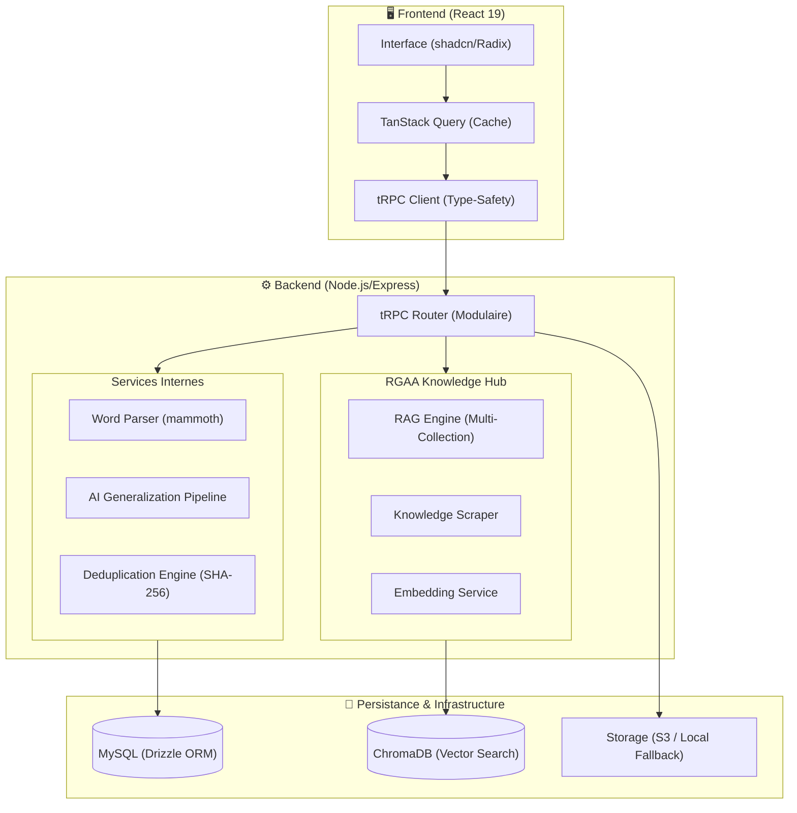

# RGAA Extractor : Spécifications Techniques & Audit Architectural

Ce document constitue un audit professionnel approfondi du projet **RGAA Extractor**. Il est structuré pour offrir une compréhension exhaustive de chaque module, des flux de données complexes, et des mécanismes d'intelligence artificielle intégrés.

---

## 1. Vue d'Ensemble & Vision Stratégique

### Problématique Métier
L'audit RGAA est une mission critique soumise à une forte charge cognitive. Le volume de données (13 thématiques, 106 critères) et la répétitivité des constats nuisent à la productivité.

### Solution Technologique
Une architecture **AI-Native** conçue pour :
1. **Désenclaver** les données des documents Word (Parsing).
2. **Capitaliser** l'expertise via une bibliothèque de templates (Dédoublonnage).
3. **Augmenter** l'auditeur via un Knowledge Hub vectoriel (RAG).

---

## 2. Cartographie des Composants (Architecture Système)

---

## 3. Analyse Modulaire Détailée

### 3.1 Le Parseur Word (`parser.ts`)
Le cerveau de l'extraction. Il ne se contente pas de lire du texte, il réconcilie deux flux :
- **Flux Texte Brut** : Découpage sémantique via Regex pour isoler Critères, Impacts, et Constats.
- **Flux HTML** : Analyse du DOM pour extraire les liens hypertextes (Pages Auditées) dans la section "Contexte".

| Étape | Mécanisme | Résultat |
| :--- | :--- | :--- |
| **Normalisation** | Suppression des `nbsp` et apostrophes typographiques. | Texte atomique facile à parser. |
| **Extraction Section** | Détection de la section "Descriptions des erreurs". | Isolation du périmètre de données. |
| **Split Constat/Solution** | Regex `/[.!?][A-ZÀ...]/` (Point suivi d'une majuscule). | Séparation intelligente sans séparateur explicite. |

### 3.2 Le Moteur de Dédoublonnage (`deduplication.ts`)
Garantit l'unicité sémantique de la bibliothèque d'expertise.
1. **Normalisation Sévère** : Lowercase, suppression accents (NFD), suppression ponctuation.
2. **Signature** : Hash SHA-256 du texte normalisé + ID du critère.
3. **Similarity** : Distance de Levenshtein pour suggérer des fusions d'expertise.

### 3.3 Stockage Hybride (`storage.ts`)
Une abstraction intelligente pour le déploiement flexible.

| Mode | Trigger | Comportement |
| :--- | :--- | :--- |
| **Local** | `!ENV.forgeApiUrl` | Écrit physiquement dans `./uploads/`. |
| **Cloud** | `ENV.forgeApiKey` | Proxy via API Forge vers un service S3. |

---

## 4. Le Knowledge Hub : Intelligence Artificielle (RAG)

Le Hub ne se contente pas de stocker des textes, il crée un espace vectoriel de connaissances.

### Flux Ingestion (Background Tasks)
Lorsqu'un rapport est complété au niveau SQL, une tâche asynchrone (`setImmediate`) lance l'indexation vectorielle. **L'échec de l'IA ne bloque jamais le métier.**

### Stratégie de Recherche Multi-Collection
Le `ragEngine.ts` interroge simultanément :
1. **`rgaa_referential`** : La loi (Critères officiels).
2. **`rgaa_findings`** : L'expérience (Vos précédents audits).
3. **`rgaa_code`** : Les solutions (Snippets de code).

> [!IMPORTANT]
> **Forçage par Référence** : Si une question mentionne un critère précis (ex: "7.1"), le moteur applique un filtre SQL de métadonnées pour booster les résultats de ce critère spécifique par rapport à la recherche sémantique pure.

---

## 5. Le Serveur MCP (Model Context Protocol)

Le projet expose sa "conscience" aux outils d'IA externes via `server/mcp.ts`.

| Type | Nom | Fonctionnalité |
| :--- | :--- | :--- |
| **Tool** | `search_criteria` | Recherche sémantique dans le référentiel. |
| **Tool** | `propose_deduplication` | Analyse de similarité entre constats. |
| **Resource** | `rgaa://criteria/...` | Accès direct au contenu d'un critère par son ID. |

---

## 6. Flux de Données Critiques

### Séquence d'Import de Rapport
1. **Upload** : Reception stream via Busboy -> Stockage (Local/S3).
2. **Parsing** : Mammoth (Word -> Text/HTML) -> `ExtractedFinding[]`.
3. **Transaction DB** :
    - Création de l'entrée `audit_reports`.
    - Upsert dans `finding_templates` (Si signatureHash inconnue).
    - Insertion batch dans `findings`.
4. **Enrichissement Hub** : Indexation asynchrone dans ChromaDB.

---

## 7. Glossaire des Technologies Avancées

- **ChromaDB** : Base de données vectorielle pour la recherche de sens.
- **tRPC (Procedure)** : Un point d'entrée API typé, agissant comme un tunnel direct entre le code serveur et le code client.
- **Drizzle (MySQL)** : ORM performant qui transforme vos tables SQL en objets TypeScript types-safe.
- **RAG (Retrieval-Augmented Generation)** : Technique consistant à "nourrir" une IA avec vos données privées avant de lui poser une question.
- **Levenshtein** : Algorithme mesurant le nombre de modifications pour passer d'un texte à un autre (Utile pour détecter les doublons).

---

## 10. Vision Future & Roadmap : Vers le "RGAA Audit Brain"

L'analyse de l'état de l'art (inspirée des meilleures pratiques d'architecture IA) dessine une trajectoire d'évolution pour transformer cet extracteur en un véritable cerveau d'audit.

### 10.1 Stratégie Multi-RAG & Spécialisation
Au lieu d'une collection unique, le système évoluera vers des "Agents RAG" spécialisés :
- **RAG Référentiel** : Vérité immuable du RGAA et WCAG.
- **RAG Expertise** : Bibliothèque de constats capitalisés (ce projet).
- **RAG Pédagogique** : Explications simplifiées et exemples de code conformes.
- **RAG Patterns** : Détection de patterns de code non-accessibles fréquents.

### 10.2 Anti-Hallucination & Précision Chirurgicale
Pour garantir la fiabilité des réponses de l'IA :
- **Seuils de Similarité Stricts** : L'IA ne répond que si le contexte trouvé est pertinent à plus de 85%.
- **Citations Obligatoires** : Chaque affirmation doit être liée à une source (Critère ou Audit passé).
- **Prompt Guards** : Instructions forçant l'IA à admettre son ignorance si les données manquent.

### 10.3 Intégrations de Demain
- **Computer Vision** : Analyser visuellement des captures d'écran pour mapper les erreurs d'interface directement aux critères RGAA.
- **Knowledge Graph** : Passer de la recherche vectorielle (sens) à une recherche structurée par graphe (liens logiques entre critères et composants techniques).
- **Connecteur MCP Global** : Une interface unique pour que n'importe quelle IA (Claude, ChatGPT, etc.) puisse utiliser nos outils d'audit directement dans l'IDE du développeur.

---
*Document haute performance - Révisé pour l'excellence technique et la vision future.*
