# Rapport Technique & Fonctionnel
## RGAA Constat Extractor — v1.0

---

**Projet** : RGAA Constat Extractor  
**Type** : Application web fullstack (SPA + API REST/tRPC)  
**Domaine** : Accessibilité numérique — Référentiel RGAA 4.1  
**Date** : Février 2026  

---

# Table des Matières

1. [Synthèse du Projet](#1-synthèse-du-projet)
2. [Architecture Technique Globale](#2-architecture-technique-globale)
3. [Modèle de Données](#3-modèle-de-données)
4. [Modules Fonctionnels](#4-modules-fonctionnels)
5. [Intelligence Artificielle & Traitement Automatique](#5-intelligence-artificielle--traitement-automatique)
6. [Serveur MCP (Model Context Protocol)](#6-serveur-mcp-model-context-protocol)
7. [Sécurité & Authentification](#7-sécurité--authentification)
8. [Qualité & Bonnes Pratiques](#8-qualité--bonnes-pratiques)

---

# 1. Synthèse du Projet

## 1.1 Contexte & Problématique

Le **RGAA 4.1** (Référentiel Général d'Amélioration de l'Accessibilité) impose aux organismes publics français de produire des rapports d'audit d'accessibilité structurés. Ces audits génèrent des **constats de non-conformité** répartis sur **13 thématiques** et **106 critères**.

**Problème identifié** : les auditeurs manipulent manuellement des fichiers Word volumineux, ce qui rend la capitalisation, la recherche et la réutilisation des constats pratiquement impossible.

## 1.2 Solution — RGAA Constat Extractor

Une application web qui **automatise l'extraction, la structuration et la capitalisation** des constats d'accessibilité à partir de rapports d'audit Word (.docx).

## 1.3 Vue d'ensemble des Fonctionnalités

| # | Module | Description | Détails |
|---|---|---|---|
| 1 | **Upload & Import** | Drag & drop de fichiers .docx avec détection de doublons | [→ §4.1](#41-upload--import-de-rapports) |
| 2 | **Parseur Word** | Extraction automatique des constats depuis les documents Word | [→ §4.2](#42-parseur-de-documents-word) |
| 3 | **Gestion des Rapports** | Suivi de statut, traitement asynchrone, suppression en cascade | [→ §4.3](#43-gestion-des-rapports) |
| 4 | **Audit Explorer** | Exploration multi-dimensionnelle des constats avec filtres avancés | [→ §4.4](#44-audit-explorer) |
| 5 | **Bibliothèque d'Expertise** | Modèles de constats réutilisables avec workflow de validation | [→ §4.5](#45-bibliothèque-dexpertise) |
| 6 | **Assistant de Rédaction** | Identification de critères par analyse sémantique + suggestions | [→ §4.6](#46-assistant-de-rédaction) |
| 7 | **Dashboard Statistique** | Graphiques interactifs (impact, thématiques, couverture) | [→ §4.7](#47-dashboard-statistique) |
| 8 | **AI Hub (MCP)** | Intégration IA via le Model Context Protocol (5 outils) | [→ §6](#6-serveur-mcp-model-context-protocol) |

## 1.4 Stack Technologique (Résumé)

| Couche | Technologies |
|---|---|
| **Frontend** | React 19, wouter, Radix UI / shadcn, TailwindCSS 4, Framer Motion, recharts |
| **Backend** | Express.js, tRPC v11, Zod v4 |
| **Base de données** | MySQL via Drizzle ORM (migrations auto) |
| **Stockage** | Dual-mode : local (`./uploads/`) ou S3 distant |
| **IA** | Pipeline de généralisation + déduplication Levenshtein + MCP Server |
| **Outils** | TypeScript 5.9, Vite 7, Vitest, pnpm |

→ Détails complets : [§2 — Architecture Technique Globale](#2-architecture-technique-globale)

## 1.5 Diagramme d'Architecture (Aperçu)

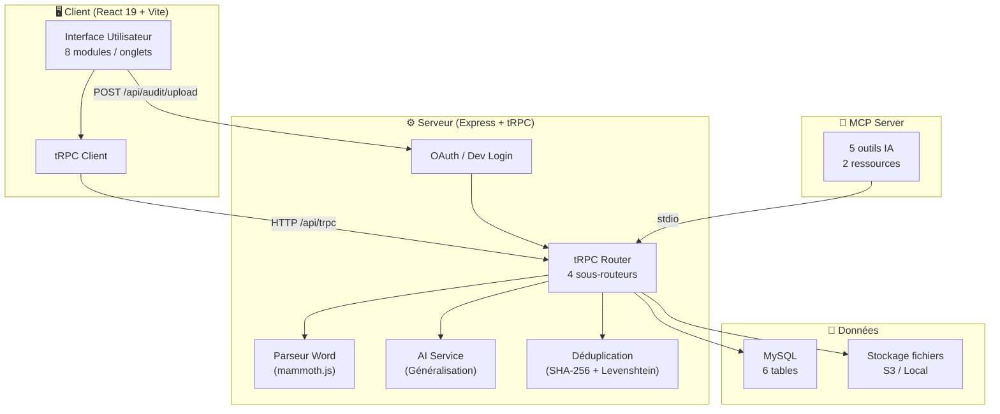

→ Diagramme détaillé : [§2.2](#22-diagramme-darchitecture-détaillé)

---

# 2. Architecture Technique Globale

## 2.1 Organisation du Code Source

Le projet adopte une architecture **monorepo fullstack** avec séparation claire des responsabilités :

```
rgaa-extractor-complete/
├── client/                    # Frontend React
│   └── src/
│       ├── components/        # 14 composants métier + 54 composants UI (shadcn)
│       ├── pages/             # 3 pages (Home, ComponentShowcase, NotFound)
│       ├── hooks/             # 3 hooks personnalisés
│       ├── contexts/          # Contexte thème (ThemeProvider)
│       ├── lib/               # Client tRPC + utilitaires
│       └── _core/             # Auth hooks
│
├── server/                    # Backend Express/tRPC
│   ├── _core/                 # Bootstrap serveur, OAuth, cookies, tRPC, Vite
│   ├── repositories/          # 5 repositories (pattern DAO)
│   ├── services/              # AI Service (Pipeline de généralisation)
│   ├── utils/                 # Déduplication (normalisation + hashing)
│   ├── routers.ts             # Routeur tRPC principal (4 sous-routeurs)
│   ├── parser.ts              # Parseur de documents Word
│   ├── mcp.ts                 # Serveur MCP (Model Context Protocol)
│   ├── storage.ts             # Abstraction stockage (S3 / local)
│   ├── db.ts                  # Barrel re-export de tous les repositories
│   └── rgaa-data.ts           # Référentiel RGAA 4.1 complet (13 thématiques, 106 critères)
│
├── shared/                    # Types et constantes partagés client/server
├── drizzle/                   # Schéma BDD + migrations
└── vite.config.ts             # Configuration build
```

## 2.2 Diagramme d'Architecture Détaillé

```mermaid
graph LR
    subgraph Frontend["Frontend (React 19)"]
        direction TB
        V["Vite 7 (bundler)"]
        R["React 19 + wouter"]
        SH["shadcn (Radix UI)"]
        TW["TailwindCSS 4"]
        FM["Framer Motion"]
        RC["recharts"]
        TQ["TanStack React Query"]
        TC["tRPC Client v11"]
    end

    subgraph Backend["Backend (Node.js)"]
        direction TB
        EX["Express.js"]
        TS["tRPC Server v11"]
        ZOD["Zod v4 (validation)"]
        BB["Busboy (upload multipart)"]
        MM["mammoth.js (Word parser)"]
        JO["jose (JWT)"]
    end

    subgraph Repositories["Couche Données"]
        direction TB
        UR["userRepository"]
        RR["reportRepository"]
        FR["findingRepository"]
        TR["templateRepository"]
        REF["referentialRepository"]
    end

    subgraph Database["Base de Données"]
        DR["Drizzle ORM"]
        MY["MySQL"]
    end

    subgraph Storage["Stockage"]
        S3["AWS S3"]
        LOC["Filesystem local"]
    end

    subgraph AI_Layer["Couche IA"]
        AIS["GeneralizationPipeline"]
        DED["Déduplication Engine"]
        MCP_SRV["MCP Server (stdio)"]
    end

    Frontend -->|"JSON-RPC via HTTP"| Backend
    Backend --> Repositories
    Repositories --> Database
    Backend --> Storage
    Backend --> AI_Layer
    AI_Layer -->|"tRPC caller interne"| Repositories
    DR --> MY
```

## 2.3 Stack Technologique — Justification des Choix

### Frontend

| Technologie | Version | Justification |
|---|---|---|
| **React** | 19 | Écosystème mature, composition par composants, gestion d'état via hooks |
| **wouter** | 3.3 | Routeur léger (~1.5KB) adapté aux SPA simples — alternative à React Router |
| **Radix UI / shadcn** | dernier | Composants accessibles (WAI-ARIA) nativement — cohérent avec le domaine RGAA |
| **TailwindCSS** | 4 | Utility-first CSS, élimination du dead CSS, thème cohérent |
| **Framer Motion** | 12 | Animations fluides pour UX premium (transitions, apparitions) |
| **recharts** | 2.15 | Graphiques SVG déclaratifs intégrés à React |
| **TanStack React Query** | 5 | Cache intelligent, invalidation, retry automatique pour les appels tRPC |

### Backend

| Technologie | Version | Justification |
|---|---|---|
| **Express.js** | 4 | Serveur HTTP standard, compatible middleware tRPC |
| **tRPC** | 11 | Type-safety end-to-end sans génération de code — le client connaît les types du serveur |
| **Zod** | 4 | Validation de schéma à l'exécution + inférence TypeScript — couplé nativement à tRPC |
| **mammoth.js** | 1.11 | Conversion Word → HTML/texte fidèle sans dépendances binaires |
| **Busboy** | 1.6 | Parsing multipart/form-data en streaming (upload de gros fichiers) |
| **jose** | 6.1 | Bibliothèque JWT moderne pour la gestion des tokens OAuth |

### Données & Infra

| Technologie | Version | Justification |
|---|---|---|
| **MySQL** | — | SGBD relationnel robuste, adapté aux données structurées des audits |
| **Drizzle ORM** | 0.44 | ORM TypeScript-first avec migrations déclaratives, pas de magie noire |
| **AWS S3** | SDK v3 | Stockage objet scalable — fallback local pour le développement |
| **MCP SDK** | 1.26 | Protocole standardisé pour l'intégration d'outils IA avec des LLMs |

## 2.4 Communication Client ↔ Serveur

Deux canaux de communication coexistent :

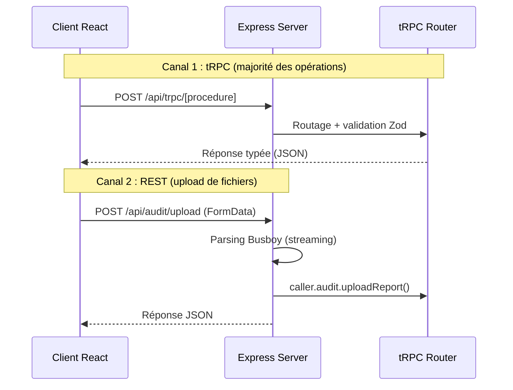

**Pourquoi deux canaux ?** tRPC ne supporte pas nativement les uploads multipart. Le fichier est reçu par une route Express classique (via Busboy en streaming), puis la logique métier est déléguée au routeur tRPC via un `caller` interne. Cela conserve la centralisation de la logique dans le routeur.

> **Fichier source** : [index.ts](file:///c:/Users/user/Desktop/rgaa-extractor-complete/server/_core/index.ts) — Bootstrap du serveur

---

# 3. Modèle de Données

## 3.1 Diagramme Entité-Relation

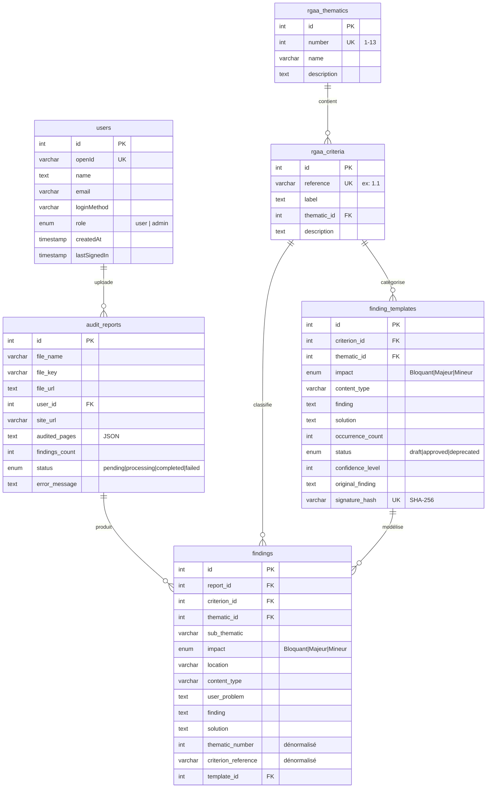

## 3.2 Description des Tables

### `users` — Utilisateurs

Gestion des utilisateurs via OAuth ou mode développement local. Le champ `openId` est l'identifiant unique retourné par le fournisseur OAuth.

### `rgaa_thematics` — 13 Thématiques RGAA 4.1

| N° | Thématique |
|----|-----------|
| 1 | Images |
| 2 | Cadres |
| 3 | Couleurs |
| 4 | Multimédia |
| 5 | Tableaux |
| 6 | Liens |
| 7 | Scripts |
| 8 | Éléments obligatoires |
| 9 | Structuration de l'information |
| 10 | Présentation de l'information |
| 11 | Formulaires |
| 12 | Navigation |
| 13 | Consultation |

Initialisées automatiquement au démarrage du serveur depuis les données statiques (`rgaa-data.ts`).

> **Fichier source** : [rgaa-data.ts](file:///c:/Users/user/Desktop/rgaa-extractor-complete/server/rgaa-data.ts) — Référentiel complet

### `rgaa_criteria` — Critères d'Accessibilité

106 critères associés aux 13 thématiques. Chaque critère possède une **référence unique** (ex: `1.1`, `8.3`, `13.7`) et un libellé descriptif.

### `audit_reports` — Rapports d'Audit

Chaque rapport correspond à un fichier Word uploadé. Le champ `auditedPages` stocke en JSON la liste des pages auditées extraites automatiquement du document (nom + URL).

**Cycle de vie** : `pending` → `processing` → `completed` | `failed`

### `findings` — Constats d'Accessibilité

Table centrale du système. Chaque constat est une **non-conformité détectée**, liée à un rapport, un critère et une thématique. Contient des champs dénormalisés (`thematicNumber`, `criterionReference`) pour optimiser les requêtes de filtrage sans JOINs systématiques.

### `finding_templates` — Bibliothèque de Constats Génériques

Constats **réutilisables** extraits et consolidés à partir de multiples rapports. Le champ `signatureHash` (SHA-256) garantit l'unicité sémantique. Le compteur `occurrenceCount` mesure la fréquence d'apparition d'un constat dans les audits.

**Workflow** : `draft` → `approved` → `deprecated`

> **Fichier source** : [schema.ts](file:///c:/Users/user/Desktop/rgaa-extractor-complete/drizzle/schema.ts) — Schéma Drizzle complet

## 3.3 Stratégie de Dénormalisation

Les champs `thematicNumber` et `criterionReference` dans la table `findings` sont volontairement dénormalisés. Cette décision technique répond à un besoin de performance :

- Les filtres côté client portent souvent sur la thématique ou la référence du critère
- Évite un JOIN systématique avec `rgaa_criteria` / `rgaa_thematics` pour les requêtes de listing
- Les données dénormalisées ne changent jamais (un constat conserve sa thématique)

Pour les vues enrichies (Audit Explorer), un JOIN explicite reste utilisé via `getEnrichedFindings()` pour récupérer les libellés complets.

> **Fichier source** : [findingRepository.ts](file:///c:/Users/user/Desktop/rgaa-extractor-complete/server/repositories/findingRepository.ts) — Repository des constats

---

# 4. Modules Fonctionnels

## 4.1 Upload & Import de Rapports

### Description

Module d'import de fichiers Word (`.docx`) contenant les rapports d'audit RGAA 4.1. Le système supporte le **drag & drop** et le sélecteur de fichiers classique.

### Flux Utilisateur

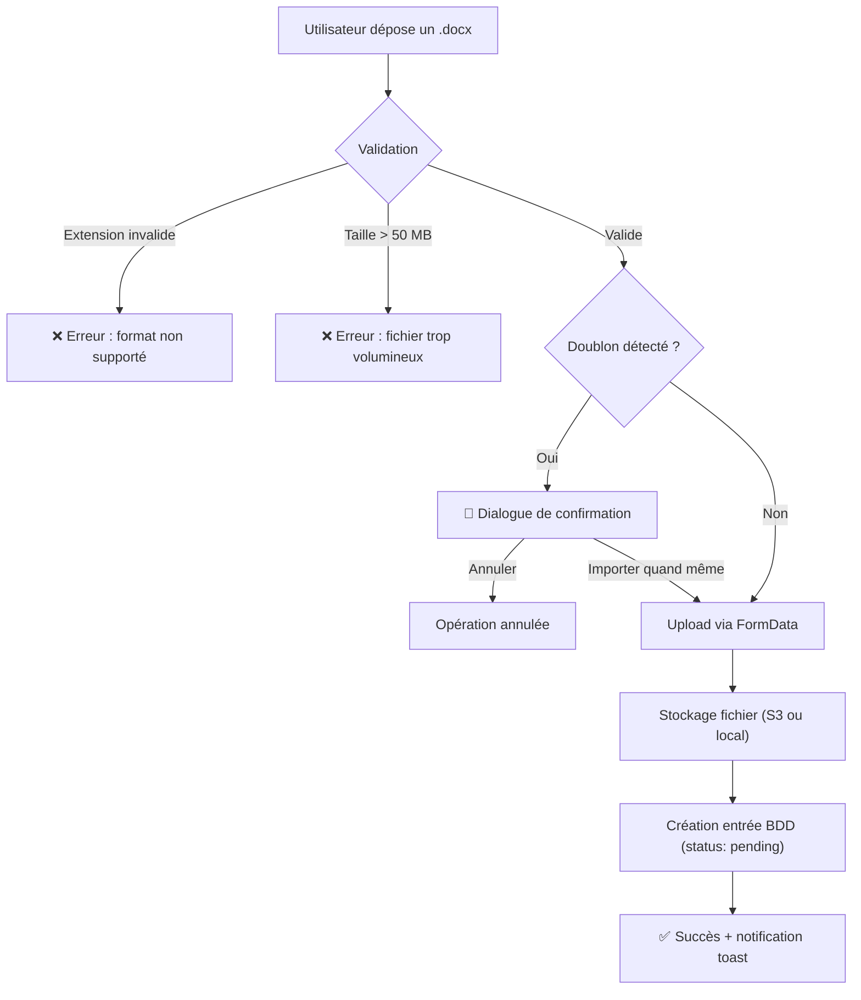

### Points Techniques

- **Détection de doublons** : vérification en BDD par `checkDuplicateReport(userId, fileName)` avant upload
- **Upload multipart** : parsing streaming via **Busboy** (pas de buffering mémoire complet)
- **Stockage dual** : sélection automatique entre local (dev) et S3 (production) via détection des variables d'environnement

> **Fichiers sources** :
> - [UploadSection.tsx](file:///c:/Users/user/Desktop/rgaa-extractor-complete/client/src/components/UploadSection.tsx) — Composant client
> - [index.ts](file:///c:/Users/user/Desktop/rgaa-extractor-complete/server/_core/index.ts#L55-L112) — Route Express upload
> - [storage.ts](file:///c:/Users/user/Desktop/rgaa-extractor-complete/server/storage.ts) — Abstraction stockage

---

## 4.2 Parseur de Documents Word

### Description

Le parseur est le **cœur technique** de l'application. Il transforme un buffer binaire Word en un ensemble structuré de constats exploitables.

### Pipeline de Parsing

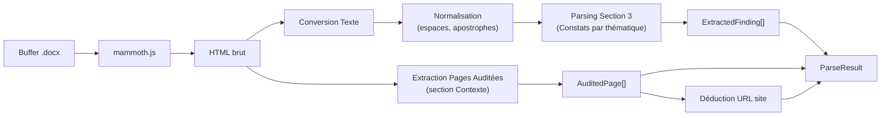

### Structures de Données Extraites

```typescript
interface ExtractedFinding {
  thematicNumber: number;        // Ex: 1 (Images)
  thematicName: string;          // Ex: "Images"
  subThematic?: string;          // Ex: "Alternatives aux images"
  criterionReference: string;    // Ex: "1.1"
  criterionLabel: string;        // Ex: "Chaque image porteuse..."
  impact: "Bloquant" | "Majeur" | "Mineur";
  location?: string;             // Ex: "Page Accueil"
  contentType?: string;          // Ex: "Images", "Liens"
  userProblem?: string;          // Impact pour l'usager
  finding: string;               // Description du problème
  solution?: string;             // Action corrective
}

interface AuditedPage {
  name: string;                  // Ex: "Accueil"
  url: string;                   // Ex: "https://example.com/"
}

interface ParseResult {
  findings: ExtractedFinding[];
  auditedPages: AuditedPage[];
  siteUrl: string;               // URL de base déduite
  diagnostics: ParserDiagnostic[];
}
```

### Algorithme de Parsing (Section 3)

Le parsing du contenu textuel suit une logique hiérarchique :

1. **Détection des thématiques** via regex : `^(\d+)\s*[-–—.]\s*(.+)`
2. **Détection des critères** via regex : `Critère\s*(\d+\.\d+)`
3. **Extraction des champs** par reconnaissance de labels : `Impact :`, `Localisation :`, `Constat :`, `Solution :`
4. **Gestion des constats multiples** par critère (séparateur détecté automatiquement)

### Système de Diagnostics

Le parseur intègre un système de diagnostics à 3 niveaux (`info`, `warn`, `error`) qui remonte les anomalies détectées pendant le parsing : champs manquants, sections non reconnues, structure inattendue.

> **Fichier source** : [parser.ts](file:///c:/Users/user/Desktop/rgaa-extractor-complete/server/parser.ts) — Parseur de documents Word

---

## 4.3 Gestion des Rapports

### Description

Module de suivi du cycle de vie des rapports importés : listing, traitement, suppression.

### Cycle de Vie d'un Rapport

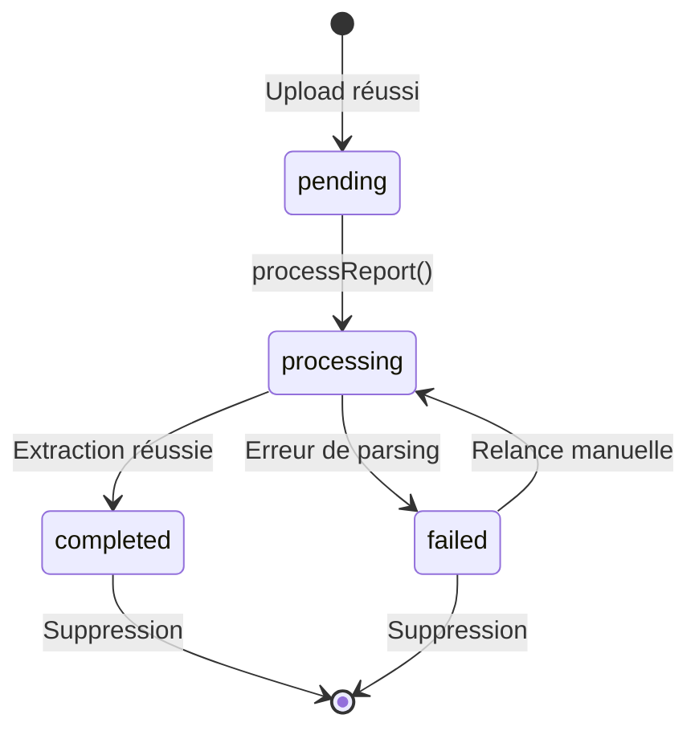

### Traitement d'un Rapport (`processReport`)

Le traitement est déclenché manuellement par l'utilisateur et effectue les opérations suivantes :

1. **Vérification de propriété** : seul le propriétaire peut traiter son rapport
2. **Récupération du fichier** : lecture depuis le stockage (local ou S3)
3. **Parsing du document** : extraction des constats via `parseAuditReportBuffer()`
4. **Résolution des critères** : chargement en une requête de tous les critères (élimine le problème N+1)
5. **Déduplication** : pour chaque constat, génération d'une signature SHA-256 et upsert dans la bibliothèque de templates
6. **Insertion batch** : tous les constats sont insérés en une seule transaction MySQL (rollback automatique en cas d'erreur)
7. **Mise à jour des métadonnées** : URL du site, pages auditées, nombre de constats, statut

### Suppression en Cascade

La suppression d'un rapport entraîne :
- Suppression du fichier dans le stockage (S3 ou local)
- Suppression de tous les constats associés en BDD
- Suppression de l'entrée rapport

> **Fichiers sources** :
> - [routers.ts](file:///c:/Users/user/Desktop/rgaa-extractor-complete/server/routers.ts#L155-L287) — Procédure `processReport`
> - [reportRepository.ts](file:///c:/Users/user/Desktop/rgaa-extractor-complete/server/repositories/reportRepository.ts) — Repository des rapports

---

## 4.4 Audit Explorer

### Description

Module d'exploration **multi-dimensionnelle** des constats extraits. Permet de naviguer dans les données d'audit selon plusieurs axes : rapport, thématique, critère, impact, page.

### Fonctionnalités

| Fonctionnalité | Description |
|---|---|
| **Filtrage multi-critères** | Par rapport(s), thématique, critère, impact, nom de page |
| **Regroupement dynamique** | Par rapport, par critère, par thématique |
| **Vue enrichie** | Chaque constat affiche le nom du rapport source, le critère avec son libellé complet |
| **Expand/Collapse** | Navigation hiérarchique avec expand/collapse par groupe |
| **Extraction nom de site** | Le nom du site audité est déduit du nom de fichier du rapport |

### Requête Enrichie (JOIN Triple)

La vue enrichie repose sur un `LEFT JOIN` triple entre `findings`, `audit_reports` et `rgaa_criteria` :

```
findings ← LEFT JOIN audit_reports (reportId)
findings ← LEFT JOIN rgaa_criteria (criterionId)
```

Cela permet d'afficher en une seule requête : le constat, le nom du rapport source, l'URL du site audité, et le libellé complet du critère RGAA.

> **Fichiers sources** :
> - [FindingsLibrary.tsx](file:///c:/Users/user/Desktop/rgaa-extractor-complete/client/src/components/FindingsLibrary.tsx) — Composant client (536 lignes)
> - [findingRepository.ts](file:///c:/Users/user/Desktop/rgaa-extractor-complete/server/repositories/findingRepository.ts#L115-L184) — `getEnrichedFindings()`

---

## 4.5 Bibliothèque d'Expertise

### Description

Système de **modèles de constats réutilisables** (Finding Templates). Chaque constat extrait alimente automatiquement cette bibliothèque, permettant de constituer progressivement une base de connaissance d'expertise en accessibilité.

### Workflow des Templates

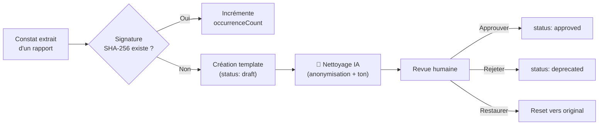

### Fonctionnalités

| Action | Description |
|---|---|
| **Recherche** | Par texte libre, critère, impact, statut |
| **Édition inline** | Modification directe du constat et de la solution |
| **Nettoyage IA** | Anonymisation + alignement du ton via `GeneralizationPipeline` |
| **Nettoyage en lot** | `bulkGeneralize` : traite tous les templates en statut `draft` |
| **Synchronisation** | `syncTemplates` : indexe tous les constats orphelins |
| **Restauration** | `resetTemplate` : retour à la version originale avant nettoyage |

### Gestion des Occurrences

Le compteur `occurrenceCount` permet de mesurer la **fréquence d'apparition** d'un défaut d'accessibilité à travers les audits. Un constat fréquemment rencontré (occurrence élevée) signale un problème récurrent méritant une attention prioritaire.

> **Fichiers sources** :
> - [ExpertiseLibrary.tsx](file:///c:/Users/user/Desktop/rgaa-extractor-complete/client/src/components/ExpertiseLibrary.tsx) — Composant client (363 lignes)
> - [templateRepository.ts](file:///c:/Users/user/Desktop/rgaa-extractor-complete/server/repositories/templateRepository.ts) — Repository des templates

---

## 4.6 Assistant de Rédaction

### Description

Module d'aide à la rédaction de constats d'accessibilité. L'auditeur saisit un **brouillon** en langage naturel, et le système identifie automatiquement le critère RGAA correspondant et propose des améliorations.

### Pipeline de Traitement

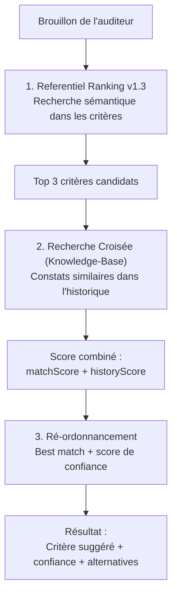

### Algorithme de Ranking Sémantique

Le système de ranking des critères fonctionne en 3 étapes :

**Étape 1 — Matching Référentiel** :
- Tokenisation du brouillon avec filtrage des stop-words français
- Recherche LIKE dans les labels et descriptions des critères
- Pondération des mots techniques (ex: `bouton`, `image`, `formulaire` → +10 points)
- Dépondération des mots méta-audit (ex: `pertinent`, `accessible` → poids faible)

**Étape 2 — Enrichissement Historique** :
- Pour chaque critère candidat, recherche de constats similaires dans l'historique
- Bonus de 15 points par constat historique trouvé

**Étape 3 — Score de Confiance** :
- Calcul basé sur l'écart entre les scores des deux meilleurs candidats
- Formule : `confidence = min(0.95, (s1 / (s1 + s2)) × 0.9 + 0.1)`

> **Fichiers sources** :
> - [DraftingAssistant.tsx](file:///c:/Users/user/Desktop/rgaa-extractor-complete/client/src/components/DraftingAssistant.tsx) — Composant client
> - [routers.ts](file:///c:/Users/user/Desktop/rgaa-extractor-complete/server/routers.ts#L406-L463) — Procédure `generateFromDraft`
> - [referentialRepository.ts](file:///c:/Users/user/Desktop/rgaa-extractor-complete/server/repositories/referentialRepository.ts#L108-L165) — `searchCriteria()`

---

## 4.7 Dashboard Statistique

### Description

Tableau de bord interactif présentant une vue synthétique de l'activité d'audit via des graphiques **recharts**.

### Métriques Affichées

| Métrique | Type | Description |
|---|---|---|
| Rapports uploadés | KPI (nombre) | Nombre total de rapports importés |
| Constats extraits | KPI (nombre) | Nombre total de constats dans la base |
| Thématiques couvertes | KPI (nombre) | Nombre de thématiques RGAA ayant au moins un constat |
| Distribution par impact | Pie Chart | Répartition Bloquant / Majeur / Mineur |
| Constats par thématique | Bar Chart | Nombre de constats par thématique RGAA (1-13) |

### Calcul Côté Client

Les statistiques sont calculées côté client via `useMemo()` à partir des données enrichies (`getEnrichedFindings`). Ce choix permet de :
- Réduire la charge serveur (pas de requêtes d'agrégation dédiées)
- Garantir la cohérence entre les différentes vues (même source de données)
- Permettre un filtrage/regroupement dynamique sans aller-retour réseau

> **Fichier source** : [StatsOverview.tsx](file:///c:/Users/user/Desktop/rgaa-extractor-complete/client/src/components/StatsOverview.tsx) — Dashboard (185 lignes)

---

# 5. Intelligence Artificielle & Traitement Automatique

## 5.1 Pipeline de Généralisation (`GeneralizationPipeline`)

### Architecture

Le service d'IA est implémenté sous forme de **pipeline séquentiel** appliquant des règles de transformation déterministes :

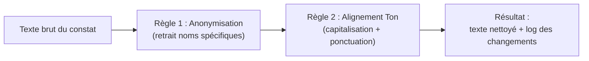

### Détail des Règles

| Règle | Méthode | Description | Regex |
|---|---|---|---|
| **Anonymisation** | `ruleAnonymize()` | Supprime les noms entre guillemets français (`« ... »`) | `«\s*[^»]+\s*»` |
| **Alignement Ton** | `ruleAlignTone()` | Majuscule initiale + ponctuation finale obligatoire | Logique conditionnelle |

### Traçabilité

Le pipeline retourne un objet `CleaningResult` contenant :
- `original` : texte avant transformation
- `cleaned` : texte après transformation
- `changes[]` : liste des transformations appliquées (ex: `"Retrait des noms spécifiques"`)

> **Fichier source** : [aiService.ts](file:///c:/Users/user/Desktop/rgaa-extractor-complete/server/services/aiService.ts) — Pipeline de généralisation

## 5.2 Moteur de Déduplication

### Objectif

Éviter la duplication sémantique des constats à travers les rapports. Deux constats formulés différemment mais décrivant le même problème doivent être regroupés sous un même **template**.

### Processus

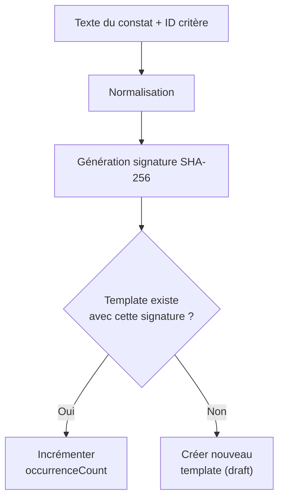

### Normalisation (`normalizeFindingText`)

La normalisation applique les transformations suivantes :

1. Passage en minuscules
2. Suppression des balises HTML
3. Remplacement de la ponctuation par des espaces
4. Décomposition Unicode NFD (suppression des accents)
5. Conservation uniquement des lettres et chiffres
6. Compression des espaces multiples

### Similitude Sémantique (`calculateSimilarity`)

Pour les comparaisons plus nuancées (outil MCP `propose_deduplication`), le système calcule une **distance de Levenshtein normalisée** :

```
similarity = 1 - (levenshteinDistance / max(len1, len2))
```

Le seuil de pertinence est fixé à **0.6** (60% de similitude minimale).

> **Fichier source** : [deduplication.ts](file:///c:/Users/user/Desktop/rgaa-extractor-complete/server/utils/deduplication.ts) — Normalisation + Hashing + Levenshtein

---

# 6. Serveur MCP (Model Context Protocol)

## 6.1 Présentation

Le serveur MCP expose les données et fonctionnalités de l'application à des **agents IA externes** (LLMs, assistants) via le protocole standardisé **Model Context Protocol**. Il permet à un agent IA de :

- Consulter le référentiel RGAA et les rapports d'audit
- Rechercher dans la bibliothèque d'expertise
- Analyser les doublons sémantiques

## 6.2 Architecture MCP

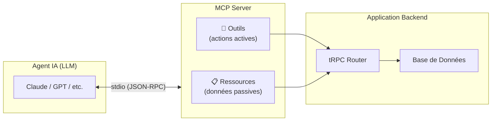

## 6.3 Ressources Exposées (Read-Only)

| URI | Nom | Description |
|---|---|---|
| `rgaa://criteria` | Référentiel RGAA 4.1 | Liste complète des 106 critères d'accessibilité |
| `rgaa://reports` | Rapports d'audit | Liste des rapports importés par l'utilisateur |

## 6.4 Outils Disponibles (Actions)

| Outil | Description | Paramètres |
|---|---|---|
| `search_rgaa_expertise` | Recherche dans la bibliothèque de constats approuvés | `q` : terme technique ou fonctionnel |
| `get_expertise_by_criterion` | Modèles de constats pour un critère RGAA | `criterionReference` : ex. `"8.3"` |
| `get_report_findings` | Constats d'un rapport spécifique | `reportId` : ID du rapport |
| `search_findings` | Recherche transversale avec filtres | `criterionReference`, `impact`, `reportId` |
| `propose_deduplication` | Détection de doublons sémantiques | `findingText`, `criterionReference` |

### Exemple de Scénario d'Utilisation

Un agent IA assiste un auditeur :

> **Auditeur** : *"J'ai trouvé un bouton sans texte accessible, comment le formuler ?"*  
> **Agent IA** → appel `search_rgaa_expertise({ q: "bouton texte accessible" })`  
> **Agent IA** → appel `get_expertise_by_criterion({ criterionReference: "11.9" })`  
> **Résultat** : l'agent retourne des modèles de constats validés pour ce critère, avec les formulations professionnelles déjà approuvées.

## 6.5 Implémentation Technique

Le serveur MCP crée un **caller tRPC interne** pour accéder aux mêmes procédures que l'interface web, garantissant une cohérence totale des données. Le transport est **stdio** (standard input/output), le format standard pour les intégrations MCP avec les clients LLM.

> **Fichier source** : [mcp.ts](file:///c:/Users/user/Desktop/rgaa-extractor-complete/server/mcp.ts) — Serveur MCP (249 lignes)

---

# 7. Sécurité & Authentification

## 7.1 Flux d'Authentification

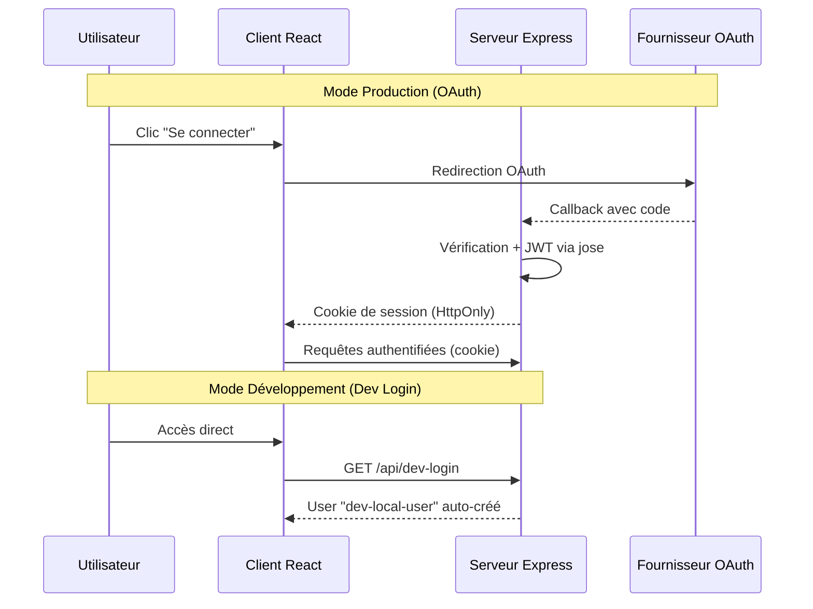

## 7.2 Protection des Routes

Le système distingue deux types de procédures tRPC :

| Type | Middleware | Usage |
|---|---|---|
| `publicProcedure` | Aucune auth requise | Consultation : critères, constats enrichis, templates |
| `protectedProcedure` | Vérification cookie + user | Actions : upload, traitement, suppression, édition |

### Vérification de Propriété

Pour les opérations sensibles (traitement et suppression de rapports), une vérification supplémentaire s'assure que `report.userId === ctx.user.id`. Un utilisateur ne peut pas manipuler les rapports d'un autre utilisateur.

## 7.3 Validation des Entrées

**Toutes les entrées** sont validées par des schémas Zod avant d'atteindre la logique métier. Exemples :

```typescript
// Validation de l'impact (enum strict)
z.enum(["Bloquant", "Majeur", "Mineur"])

// Validation de l'ID de rapport (nombre)
z.object({ reportId: z.number() })

// Validation du statut de template (enum)
z.enum(["draft", "approved", "deprecated"])
```

Cette validation est **automatique** grâce au couplage tRPC + Zod : toute requête non conforme est rejetée avant l'exécution.

> **Fichiers sources** :
> - [oauth.ts](file:///c:/Users/user/Desktop/rgaa-extractor-complete/server/_core/oauth.ts) — Flux OAuth
> - [context.ts](file:///c:/Users/user/Desktop/rgaa-extractor-complete/server/_core/context.ts) — Contexte de requête
> - [trpc.ts](file:///c:/Users/user/Desktop/rgaa-extractor-complete/server/_core/trpc.ts) — Définition des procédures

---

# 8. Qualité & Bonnes Pratiques

## 8.1 Type-Safety End-to-End

L'utilisation combinée de **TypeScript + tRPC + Zod + Drizzle ORM** crée une chaîne de sécurité de types complète :

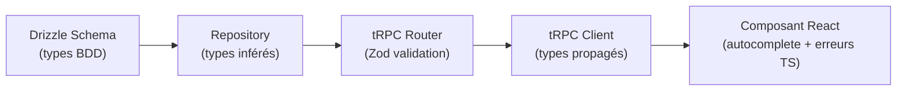

**Résultat** : un changement de schéma BDD se propage automatiquement comme erreur TypeScript dans les composants React. Aucune documentation API n'est nécessaire — les types sont le contrat.

## 8.2 Pattern Repository

L'accès aux données est organisé en **5 repositories** spécialisés, chacun responsable d'une entité métier :

| Repository | Entité | Fonctions |
|---|---|---|
| `userRepository` | Utilisateurs | `upsertUser`, `getUserByOpenId` |
| `reportRepository` | Rapports | `createAuditReport`, `getUserAuditReports`, `deleteAuditReport`, ... |
| `findingRepository` | Constats | `createFindingsBatch`, `getEnrichedFindings`, `searchSimilarFindings`, ... |
| `templateRepository` | Templates | `upsertFindingTemplateFromFinding`, `syncTemplatesFromFindings`, ... |
| `referentialRepository` | Référentiel | `initializeRgaaReferential`, `searchCriteria`, ... |

Un fichier barrel (`db.ts`) réexporte toutes les fonctions pour centraliser les imports.

> **Fichier source** : [db.ts](file:///c:/Users/user/Desktop/rgaa-extractor-complete/server/db.ts) — Barrel re-export

## 8.3 Transactions & Intégrité des Données

Les opérations critiques utilisent des **transactions MySQL** pour garantir l'atomicité :

```typescript
// Insertion batch de constats — rollback si une insertion échoue
await db.transaction(async (tx) => {
  for (const data of items) {
    await tx.insert(findings).values(data);
    count++;
  }
});
```

Le `upsert` des templates utilise `onDuplicateKeyUpdate` pour l'initialisation du référentiel (idempotence).

## 8.4 Gestion d'Erreurs

Le système met en œuvre une gestion d'erreurs à plusieurs niveaux :

| Niveau | Mécanisme | Exemple |
|---|---|---|
| **Validation** | Zod (rejet avant exécution) | Champ manquant, type incorrect |
| **Métier** | TRPCError avec codes HTTP sémantiques | `NOT_FOUND`, `FORBIDDEN`, `INTERNAL_SERVER_ERROR` |
| **Parsing** | Système de diagnostics (`info`/`warn`/`error`) | Structure Word inattendue |
| **BDD** | Transactions avec rollback automatique | Échec d'insertion batch |
| **UI** | ErrorBoundary React + toast Sonner | Erreurs non interceptées |

## 8.5 Tests

Le projet intègre des tests unitaires via **Vitest** :

- `parser.test.ts` — Tests du parseur de documents Word
- `auth.logout.test.ts` — Tests de la déconnexion

Configuration : `vitest.config.ts` avec resolution des alias TypeScript.

## 8.6 Documentation du Code

Le code source est documenté en **français** avec des commentaires JSDoc systématiques :

```typescript
/**
 * Insère un lot de constats dans une transaction MySQL.
 * Si une insertion échoue, tout le lot est annulé (rollback).
 * Retourne le nombre de constats insérés.
 */
export async function createFindingsBatch(items: FindingInput[]): Promise<number>
```

Chaque champ du schéma Drizzle est accompagné d'un commentaire explicatif :

```typescript
/** Niveau d'impact (Bloquant, Majeur, Mineur) */
impact: mysqlEnum("impact", ["Bloquant", "Majeur", "Mineur"]).notNull(),
```

---

# Annexes

## A. Inventaire des Composants Client

| Composant | Lignes | Description |
|---|---|---|
| `Home.tsx` | 152 | Page principale avec 8 onglets |
| `UploadSection.tsx` | 213 | Upload drag & drop avec détection doublons |
| `ReportsManagement.tsx` | ~200 | Gestion des rapports (listing, traitement, suppression) |
| `DraftingAssistant.tsx` | 194 | Assistant de rédaction avec IA |
| `FindingsLibrary.tsx` | 536 | Audit Explorer multi-dimensionnel |
| `ExpertiseLibrary.tsx` | 363 | Bibliothèque de templates d'expertise |
| `StatsOverview.tsx` | 185 | Dashboard statistique (recharts) |
| `EvolutionReport.tsx` | 163 | Rapport d'évolution des fonctionnalités |
| `McpCapabilities.tsx` | ~600 | Vitrine des capacités MCP/IA |
| `AIChatBox.tsx` | ~300 | Interface de chat IA |
| `DashboardLayout.tsx` | ~250 | Layout principal avec sidebar |

## B. Inventaire des Routes API

### tRPC Router — `auth`

| Procédure | Type | Auth | Description |
|---|---|---|---|
| `auth.me` | query | public | Utilisateur courant |
| `auth.logout` | mutation | public | Déconnexion (suppression cookie) |

### tRPC Router — `audit`

| Procédure | Type | Auth | Description |
|---|---|---|---|
| `audit.uploadReport` | mutation | protégé | Upload d'un fichier d'audit |
| `audit.checkReportExists` | query | protégé | Vérification de doublon |
| `audit.getUserReports` | query | protégé | Liste des rapports de l'utilisateur |
| `audit.getReport` | query | protégé | Détail d'un rapport |
| `audit.getReportFindings` | query | protégé | Constats d'un rapport |
| `audit.getFilteredFindings` | query | public | Constats filtrés |
| `audit.getEnrichedFindings` | query | public | Constats enrichis (JOIN triple) |
| `audit.processReport` | mutation | protégé | Traitement complet d'un rapport |
| `audit.deleteReport` | mutation | protégé | Suppression en cascade |

### tRPC Router — `criteria`

| Procédure | Type | Auth | Description |
|---|---|---|---|
| `criteria.list` | query | public | Tous les critères |
| `criteria.getByReference` | query | public | Critère par référence |
| `criteria.listThematics` | query | public | Toutes les thématiques |
| `criteria.getThematic` | query | public | Thématique par numéro |
| `criteria.getByThematic` | query | public | Critères d'une thématique |

### tRPC Router — `findingTemplates`

| Procédure | Type | Auth | Description |
|---|---|---|---|
| `findingTemplates.search` | query | public | Recherche de templates |
| `findingTemplates.getByCriterion` | query | public | Templates par critère |
| `findingTemplates.updateTemplate` | mutation | protégé | Mise à jour d'un template |
| `findingTemplates.generalizeTemplate` | mutation | protégé | Nettoyage IA d'un template |
| `findingTemplates.syncTemplates` | mutation | protégé | Synchronisation globale |
| `findingTemplates.bulkGeneralize` | mutation | protégé | Nettoyage IA en lot |
| `findingTemplates.resetTemplate` | mutation | protégé | Restauration version originale |
| `findingTemplates.generateFromDraft` | mutation | protégé | Assistant de rédaction IA |

---

*Rapport généré le 17 février 2026 — RGAA Constat Extractor v1.0*
