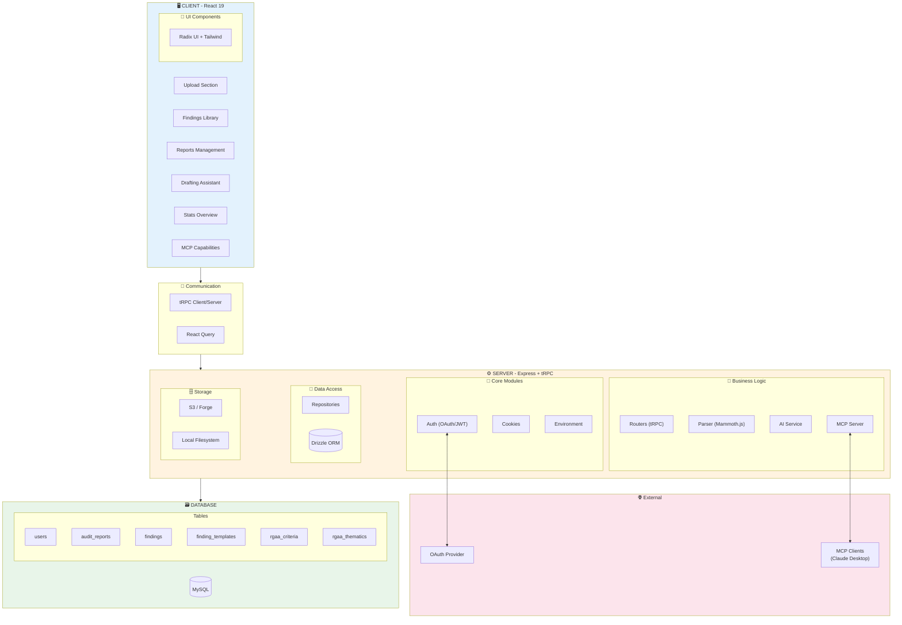
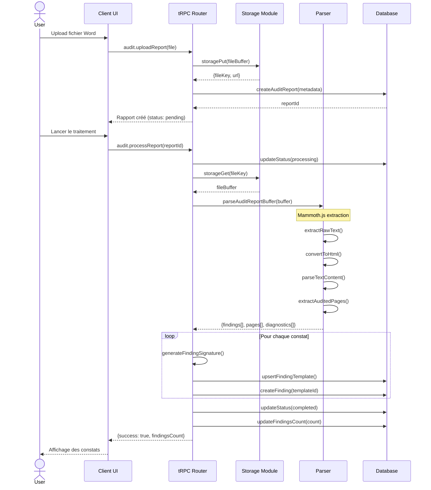
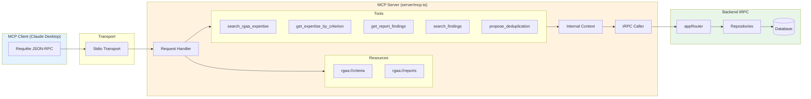
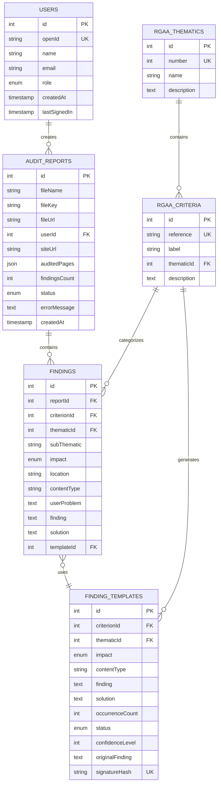
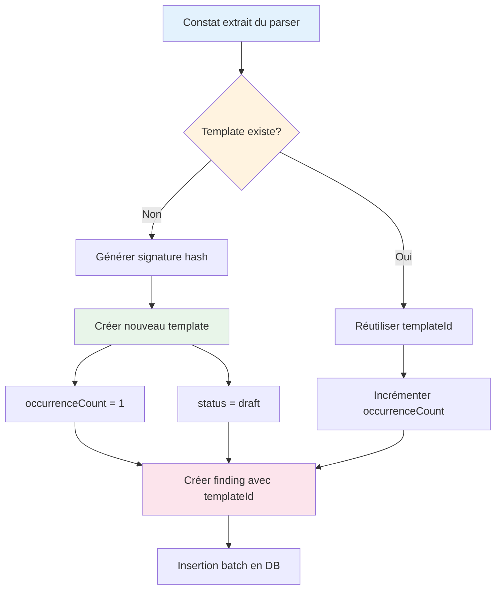
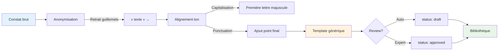

# Diagrammes Visuels - RGAA Constat Extractor

Ce dossier contient les diagrammes Mermaid pour visualiser l'architecture et les flux de données du projet.

## Architecture Globale



## Flux de Données - Upload et Parsing



## Architecture MCP (Model Context Protocol)



## Schéma Entité-Relation



## Flow de Dédoublonnage



## Architecture Parser Word

```mermaid
flowchart TD
    A[Buffer Word .docx] --> B[Mammoth.js]
    
    B --> C[extractRawText]
    B --> D[convertToHtml]
    
    C --> E[parseTextContent]
    D --> F[extractAuditedPages]
    
    E --> G[Détection Section 3]
    G --> H[lastIndexOf patterns]
    H --> I[Extraction critères]
    
    I --> J[Regex: Critère X.Y.]
    J --> K[Extraction constats]
    
    K --> L[Regex: Impact]
    L --> M[Structuration données]
    
    F --> N[Parse HTML liens]
    N --> O[Extraction URLs]
    
    M --> P[Résultat: findings[]]
    O --> Q[Résultat: pages[]]
    
    P --> R[Diagnostics]
    Q --> R
    
    R --> S[Retour: ParseResult]
    
    style A fill:#e3f2fd
    style B fill:#fff3e0
    style S fill:#e8f5e9
```

## Pipeline AI - Généralisation



---

## Utilisation des Diagrammes

Ces diagrammes peuvent être visualisés avec :
- **Mermaid Live Editor** : https://mermaid.live
- **Intégration Markdown** : Fonctionne dans GitHub, Notion, et autres
- **Export** : Utilisez le Mermaid CLI pour générer des PNG/SVG

### Exemple de rendu

Pour générer une image à partir d'un diagramme :

```bash
# Installation
npm install -g @mermaid-js/mermaid-cli

# Génération
mmdc -i architecture.mmd -o architecture.png
```
