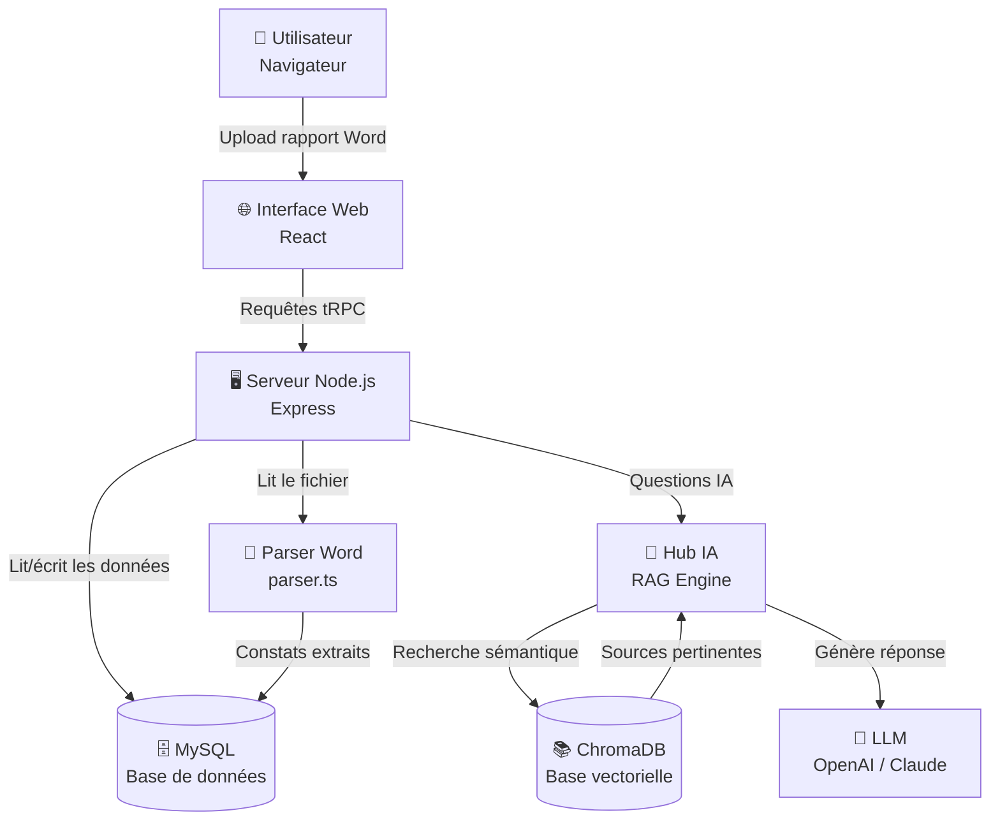
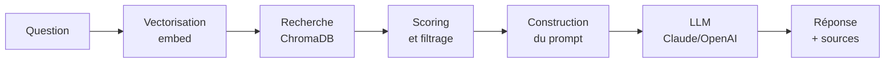

# 📘 Rapport Complet — RGAA Constat Extractor
### Comprendre le projet comme si vous y étiez pour la première fois

---

## 🧭 Avant de commencer — À qui s'adresse ce rapport ?

Ce rapport est écrit pour **quelqu'un qui débute en informatique**. Si vous ne savez pas encore ce qu'est une "base de données", un "serveur" ou une "API", ne vous inquiétez pas — chaque terme sera expliqué simplement, avec une analogie du quotidien.

> [!NOTE]
> Tout au long de ce rapport, les termes techniques sont **expliqués la première fois qu'ils apparaissent**, puis utilisés normalement. Un **glossaire complet** se trouve à la fin du document.

---

## 🎯 En une phrase : c'est quoi ce projet ?

**RGAA Constat Extractor** est un outil web qui aide les professionnels de l'accessibilité numérique à **automatiser une tâche répétitive** : extraire les erreurs d'accessibilité depuis leurs rapports Word, les organiser, les analyser, et les interroger via un assistant intelligent.

> **Le RGAA** (Référentiel Général d'Amélioration de l'Accessibilité) est le guide officiel français qui définit les règles pour rendre les sites web accessibles à tous, y compris aux personnes handicapées.

---

## 🏗️ L'architecture du projet — Vue d'ensemble

Imaginez une **agence de voyage** :

| Dans l'agence | Dans l'application |
|---|---|
| 👤 Le client | L'utilisateur dans son navigateur |
| 🧾 Le formulaire de réservation | L'interface web (React) |
| 📞 La standardiste | Le serveur (Node.js / Express) |
| 🗄️ Le grand classeur | La base de données (MySQL) |
| 🧠 L'expert conseil | Le moteur IA (RAG + LLM) |
| 📚 La bibliothèque interne | ChromaDB (base vectorielle) |



> [!IMPORTANT]
> Le projet se divise en **deux grandes parties** qui travaillent ensemble :
> - **Le Frontend** (ce que l'utilisateur voit) — dossier `client/`
> - **Le Backend** (le moteur invisible) — dossier `server/`

---

## 🔄 Le fil rouge — Ce qui se passe quand vous utilisez l'application

Voici le parcours complet d'un rapport, de l'import à la consultation. Gardez ce flux en tête pendant toute la lecture du rapport.

```
┌─────────────────────────────────────────────────────────────┐
│  ÉTAPE 1  │  L'utilisateur glisse un fichier Word           │
│           │  → Module 7 : Interface Upload                  │
├─────────────────────────────────────────────────────────────┤
│  ÉTAPE 2  │  Le serveur reçoit et stocke le fichier         │
│           │  → Module 1 : Serveur Express                   │
├─────────────────────────────────────────────────────────────┤
│  ÉTAPE 3  │  Le fichier Word est lu et décortiqué           │
│           │  → Module 2 : Le Parser                         │
├─────────────────────────────────────────────────────────────┤
│  ÉTAPE 4  │  Les erreurs extraites sont enregistrées        │
│           │  → Module 3 : La Base de Données                │
├─────────────────────────────────────────────────────────────┤
│  ÉTAPE 5  │  Les erreurs sont aussi copiées pour l'IA       │
│           │  → Module 5 : Le Hub IA                         │
├─────────────────────────────────────────────────────────────┤
│  ÉTAPE 6  │  L'utilisateur consulte, filtre, analyse        │
│           │  → Module 7 : Interface Bibliothèque / Stats    │
├─────────────────────────────────────────────────────────────┤
│  ÉTAPE 7  │  L'utilisateur pose une question à l'IA         │
│           │  → Module 5 : RAG Engine + LLM                  │
└─────────────────────────────────────────────────────────────┘
```

---

## Module 1 — Le Chef d'Orchestre (Le Serveur)
### 📁 Fichiers : `server/_core/index.ts`, `package.json`, `.env`

### 🎻 Qu'est-ce qu'un serveur ?

> [!NOTE]
> Un **serveur**, c'est comme un **restaurant**. Il attend que des clients (votre navigateur) passent des commandes, les traite, et renvoie le résultat (votre page web, vos données). Il tourne 24h/24, invisible mais indispensable.

### Ce que fait ce module au démarrage :

**1. Il ouvre "le restaurant"** — Express.js démarre et commence à écouter les connexions sur le port 3000.

**2. Il charge le menu RGAA** — Les 106 critères d'accessibilité officiels sont chargés en mémoire depuis la base de données.

**3. Il vérifie le "stock IA"** — Il regarde si la base de connaissances vectorielle (ChromaDB) contient des données. Si elle est vide, il la remplit automatiquement en arrière-plan.

**4. Il configure les routes** — Il définit quelles "commandes" (URLs) il accepte :
```
/api/audit/upload  → Pour recevoir un fichier Word
/api/trpc          → Pour toutes les autres interactions (voir Module 4)
```

**5. Il cherche un port disponible** — Si le port 3000 est occupé, il essaie 3001, 3002, etc.

### Les commandes pour lancer le projet :

| Commande | Ce que ça fait | Quand l'utiliser |
|---|---|---|
| `pnpm install` | Installe tous les outils nécessaires | Une seule fois au début |
| `pnpm db:push` | Crée les tables dans MySQL | Après une mise à jour |
| `pnpm dev` | Lance le serveur en mode développement | Tous les jours |
| `pnpm mcp` | Lance l'interface pour Claude Desktop | Pour l'IA avancée |

---

## Module 2 — Le Lecteur de Documents Word
### 📁 Fichier : `server/parser.ts`

### 📖 Qu'est-ce qu'un parser ?

> [!NOTE]
> Un **parser** (ou analyseur), c'est comme un **assistant qui lit un rapport papier à votre place** et le retranscrit dans un tableau Excel structuré. Il comprend la mise en forme du document et sait où chercher les informations importantes.

### Le problème que ce module résout

Les rapports d'audit sont écrits dans Word, par des humains, avec du texte libre. L'application doit en extraire des données **structurées** et **uniformes**. C'est le rôle du parser.

### Comment ça marche — Les 3 étapes :

**Étape 1 — Convertir le Word en texte lisible**

La bibliothèque **mammoth.js** transforme le fichier `.docx` en deux formats :
- Du **texte brut** → pour lire les erreurs (constats)
- Du **HTML** → pour lire les liens des pages auditées

**Étape 2 — Trouver la bonne section**

Le document a un sommaire et un contenu. Le parser cherche **la dernière occurrence** de la section `"Descriptions des erreurs d'accessibilité"` (pour ignorer le sommaire).

**Étape 3 — Extraire chaque erreur**

Pour chaque critère trouvé (format `Critère 1.2. ...`), le parser lit les lignes suivantes et cherche des marqueurs comme `Impact : Bloquant`.

```
Exemple de ligne détectée dans le Word :
"Page d'accueil – Impact : Bloquant L'image ne possède pas d'alternative textuelle"
                                  ↓
Constat extrait :
  - Critère    : 1.2
  - Localisation: Page d'accueil
  - Impact     : Bloquant
  - Texte      : "L'image ne possède pas d'alternative textuelle"
```

### Les données extraites pour chaque erreur :

| Champ | Exemple |
|---|---|
| Numéro de critère | `1.2` |
| Intitulé du critère | `Chaque image de décoration...` |
| Thématique | `Images` |
| Impact | `Bloquant` / `Majeur` / `Mineur` |
| Localisation | `Page d'accueil` |
| Type de contenu | `Image décorative` |
| Problème utilisateur | `Impossible pour un non-voyant...` |
| Texte du constat | `L'image ne possède pas d'alternative...` |

> [!TIP]
> Si un rapport ne s'importe pas correctement, le parser génère des **messages de diagnostic** qui expliquent exactement ce qui n'a pas été trouvé (section manquante, format inattendu, etc.).

---

## Module 3 — L'Armoire de Rangement (Base de Données)
### 📁 Dossiers : `server/repositories/`, `drizzle/`

### 🗄️ Qu'est-ce qu'une base de données ?

> [!NOTE]
> Imaginez une **armoire avec des tiroirs bien étiquetés**. Chaque tiroir contient un type d'information précis. Vous pouvez y ajouter des fiches, en chercher, en modifier ou en supprimer à tout moment.

### Les "tiroirs" du projet (les tables MySQL) :

```
📦 Base de données : rgaa_extractor
│
├── 👤 users              → Qui est connecté ?
├── 📄 audit_reports      → Quels rapports ont été importés ?
├── 🔍 findings           → Quelles erreurs ont été trouvées ?
├── 🏷️ thematics          → Les 13 thématiques RGAA
├── ✅ criteria           → Les 106 critères RGAA
├── 📋 finding_templates   → Bibliothèque de constats modèles
└── ⚙️ settings           → Configuration de l'application
```

### Les 7 "bibliothécaires" (les repositories) :

Chaque fichier dans `server/repositories/` est responsable d'un seul type de données. Cette organisation s'appelle le **pattern Repository** — une bonne pratique pour que le code reste lisible.

| Fichier | Rôle |
|---|---|
| `connection.ts` | Ouvre la connexion vers MySQL |
| `userRepository.ts` | Gère les utilisateurs |
| `referentialRepository.ts` | Lit les critères et thématiques RGAA |
| `reportRepository.ts` | Gère les rapports (créer, lire, supprimer) |
| `findingRepository.ts` | Gère les constats (filtres, stats, recherche) |
| `templateRepository.ts` | Gère la bibliothèque de constats modèles |
| `settingsRepository.ts` | Gère la configuration persistée |

> [!NOTE]
> **Drizzle ORM** est l'outil qui permet d'écrire des requêtes à la base de données **en TypeScript** plutôt qu'en SQL brut. C'est plus sûr et plus lisible.

---

## Module 4 — Le Téléphone Entre le Client et le Serveur (API tRPC)
### 📁 Dossier : `server/routers/`

### 📞 Qu'est-ce qu'une API ?

> [!NOTE]
> Une **API** (Interface de Programmation), c'est comme le **menu d'un restaurant**. Elle liste tout ce que le client (votre navigateur) peut demander au serveur. **tRPC** est une façon moderne de créer cette communication avec une sécurité de type maximale.

### Pourquoi tRPC plutôt qu'une API classique ?

Dans une API classique (REST), on envoie une requête à une URL comme `/api/findings?thematic=1`. Avec **tRPC**, c'est comme appeler une fonction directement : `trpc.audit.getEnrichedFindings({thematicNumber: 1})`. Le navigateur et le serveur parlent exactement le même langage.

### Les 6 groupes de fonctions (routers) :

```
appRouter
├── auth            → "Qui suis-je ?" / "Déconnexion"
├── audit           → Gérer les rapports d'audit
├── criteria        → Consulter le référentiel RGAA
├── findingTemplates → Bibliothèque de constats
├── hub             → Poser des questions à l'IA
└── settings        → Configurer l'application
```

### Les fonctions les plus importantes du router `audit` :

| Fonction | Type | Ce qu'elle fait |
|---|---|---|
| `uploadReport` | Écriture | Reçoit et stocke le fichier Word |
| `processReport` | Écriture | Lance le parsing + extraction des constats |
| `getUserReports` | Lecture | Liste tous les rapports de l'utilisateur |
| `getEnrichedFindings` | Lecture | Récupère les constats avec filtres |
| `deleteReport` | Écriture | Supprime un rapport et ses constats |

> [!WARNING]
> Certaines fonctions sont **protégées** (nécessitent d'être connecté). Le système vérifie automatiquement une session sécurisée avant chaque action sensible.

---

## Module 5 — L'Assistant Intelligent (Le Hub IA)
### 📁 Dossier : `server/hub/`

### 🤖 Comment fonctionne une IA qui "sait des choses" ?

> [!NOTE]
> Imaginez un **expert consultant** qui, avant de vous répondre, consulte d'abord sa bibliothèque personnelle pour trouver les cas similaires. C'est exactement ce que fait le système **RAG** (Retrieval-Augmented Generation = Génération Augmentée par la Récupération).

### Les 3 étapes du RAG expliquées simplement :

```
1. RÉCUPÉRER   → Chercher les documents pertinents dans la base de connaissances
       ↓
2. ENRICHIR    → Construire un message qui contient la question + les documents trouvés
       ↓
3. GÉNÉRER     → Envoyer ce message enrichi à un LLM (ex: ChatGPT) pour obtenir une réponse
```

### Les 7 composants du Hub :

#### 🧠 `ragEngine.ts` — Le chef d'orchestre de l'IA
C'est le cerveau central. Pour chaque question :



**3 modes de fonctionnement :**

| Mode | Situation | Qualité de réponse |
|---|---|---|
| `rag` | ChromaDB disponible avec données | ⭐⭐⭐ Maximale |
| `rag-cold-start` | ChromaDB vide (pas encore indexé) | ⭐⭐ Bonne |
| `degraded` | ChromaDB hors ligne | ⭐ Basique |

#### 📚 `chromaClient.ts` — La bibliothèque vectorielle

**ChromaDB** stocke du texte sous forme de **vecteurs** : des séries de chiffres qui représentent mathématiquement le sens d'un texte.

> [!NOTE]
> **Analogie des vecteurs** : Si "chien" et "chat" ont des vecteurs proches, ChromaDB comprend qu'ils parlent de la même chose (les animaux domestiques), même sans chercher le mot exact.

**Les 3 "rayons" de la bibliothèque :**

| Collection | Ce qu'elle contient | Priorité |
|---|---|---|
| `rgaa_referential` | Les 106 critères RGAA officiels | 🔴 Haute |
| `rgaa_findings` | Tous les constats des rapports importés | 🟡 Moyenne |
| `rgaa_code` | Exemples WAI-ARIA et patterns de code | 🟢 Normale |

#### 🌐 `knowledgeScraper.ts` — Le collecteur automatique

Ce module **collecte automatiquement** les informations pour alimenter ChromaDB :

| Source | Ce qu'il scrape | Méthode |
|---|---|---|
| `rgaaScraper` | Le site officiel du RGAA | Lecture du JSON local |
| `reportsScraper` | Les constats stockés dans MySQL | Requête base de données |
| `waiAriaScraper` | Patterns WAI-ARIA | Navigation web automatisée |

> [!TIP]
> Le scraping se déclenche **automatiquement** au démarrage si ChromaDB est vide. Il peut aussi être lancé manuellement depuis la page Paramètres.

#### 🔌 `llmAdapter.ts` — L'adaptateur de modèle IA

Ce module permet de **changer de modèle d'IA** (OpenAI, Claude, Mistral…) sans toucher au reste du code. Il suffit de changer la configuration dans `.env`.

---

## Module 6 — La Connexion avec les IA Externes (Serveur MCP)
### 📁 Fichier : `server/mcp.ts`

### 🔗 Qu'est-ce que le MCP ?

> [!NOTE]
> **MCP** (Model Context Protocol) est comme un **port USB universel** pour les IA. Il permet à un assistant comme Claude Desktop de se brancher directement à l'application et d'utiliser toutes ses fonctionnalités.

### Ce que Claude peut faire grâce au MCP :

**Consulter des données :**
- Lire la liste de tous les critères RGAA
- Voir les rapports importés
- Accéder à la configuration

**Exécuter des actions :**

| Outil | Ce que Claude peut faire |
|---|---|
| `ask_accessibility` | Poser une question sur l'accessibilité |
| `analyze_code` | Analyser du HTML et détecter des problèmes |
| `suggest_fix` | Demander une correction pour un problème |
| `get_report_findings` | Consulter les constats d'un rapport |
| `search_findings` | Chercher des constats avec des filtres |
| `validate_finding` | Valider et indexer un constat dans la base IA |

**Comment l'activer :** `pnpm mcp` — s'utilise avec Claude Desktop ou Claude Code.

---

## Module 7 — Ce que Voit l'Utilisateur (Le Frontend)
### 📁 Dossier : `client/src/`

### 🖥️ Qu'est-ce que le frontend ?

> [!NOTE]
> Le **frontend**, c'est tout ce que vous voyez dans votre navigateur : les boutons, les tableaux, les graphiques. Il est construit avec **React**, une technologie qui permet de créer des interfaces modernes et réactives.

### Les 6 onglets de l'application :

```
┌──────────────────────────────────────────────────────┐
│  📤 Upload  │  📄 Rapports  │  📚 Bibliothèque       │
│  📊 Stats   │  📈 Évolution │  🤖 Chat Expert        │
└──────────────────────────────────────────────────────┘
```

| Onglet | Ce qu'on peut faire |
|---|---|
| 📤 **Upload** | Glisser-déposer un fichier Word pour l'importer |
| 📄 **Rapports** | Voir la liste des rapports, les traiter, les supprimer |
| 📚 **Bibliothèque** | Parcourir et filtrer tous les constats extraits |
| 📊 **Stats** | Visualiser des graphiques par thématique et par impact |
| 📈 **Évolution** | Suivre les progrès au fil des audits |
| 🤖 **Chat Expert** | Poser des questions à l'assistant IA |

### La page Paramètres (`/settings`)

- Configurer la clé API du modèle IA (OpenAI, Claude…)
- Ajuster les paramètres du moteur RAG (sensibilité, nombre de sources…)
- Lancer manuellement le remplissage de la base de connaissances
- Voir le statut du dernier scraping

### Comment le frontend parle au serveur :

```
Utilisateur clique "Traiter le rapport"
          ↓
React appelle : trpc.audit.processReport({ reportId: 42 })
          ↓
tRPC envoie une requête HTTP vers /api/trpc
          ↓
Le serveur traite et répond
          ↓
React met à jour l'affichage automatiquement
```

---

## Module 8 — Les Outils de Maintenance (Scripts)
### 📁 Dossier : `scripts/`

Ces fichiers sont des **outils de secours** utilisés uniquement par les développeurs pour diagnostiquer ou réparer l'application.

| Script | Utilité |
|---|---|
| `create-db.ts` | Crée la base de données MySQL si elle n'existe pas |
| `inspect_db.ts` | Inspecte l'état de la base de données |
| `debug_rag_content.ts` | Vérifie ce qui est stocké dans ChromaDB |
| `dump_chroma.ts` | Exporte le contenu de ChromaDB |
| `repair_rgaa.ts` | Répare le référentiel RGAA en cas de problème |
| `test_perfection.ts` | Teste la qualité des réponses du moteur IA |

> [!WARNING]
> Ces scripts ne sont **jamais utilisés par l'utilisateur final**. Ils sont réservés aux développeurs pour la maintenance technique.

---

## 📖 Glossaire — Les termes techniques expliqués

| Terme | Explication simple |
|---|---|
| **API** | Le "menu" qui liste ce qu'un serveur peut faire |
| **Backend** | La partie invisible de l'application (le serveur) |
| **Base de données** | Un système de rangement structuré pour stocker des informations |
| **ChromaDB** | Une base de données spéciale qui comprend le sens des textes |
| **DOCX** | Le format de fichier des documents Microsoft Word |
| **Drizzle ORM** | Outil pour parler à MySQL en TypeScript plutôt qu'en SQL |
| **Express.js** | Le framework qui crée le serveur web Node.js |
| **Frontend** | La partie visible de l'application (le navigateur) |
| **LLM** | Modèle de langage comme ChatGPT ou Claude |
| **MCP** | Protocole qui permet aux IA de se brancher à des applications |
| **MySQL** | Système de base de données relationnelle (comme des tableaux Excel liés) |
| **Node.js** | Technologie pour exécuter du JavaScript côté serveur |
| **Parser** | Programme qui lit et structure du texte non structuré |
| **RAG** | Technique qui enrichit une IA avec des documents avant de générer une réponse |
| **React** | Bibliothèque JavaScript pour créer des interfaces utilisateur dynamiques |
| **Repository** | Fichier responsable de toutes les opérations sur un type de donnée |
| **RGAA** | Le référentiel français d'accessibilité numérique |
| **Scraping** | Collecte automatique d'informations depuis des sources en ligne |
| **Serveur** | Un ordinateur (ou programme) qui répond aux demandes d'autres ordinateurs |
| **tRPC** | Système de communication typé entre frontend et backend |
| **TypeScript** | JavaScript avec des règles plus strictes pour éviter les erreurs |
| **Vecteur** | Représentation mathématique du sens d'un texte (pour l'IA) |
