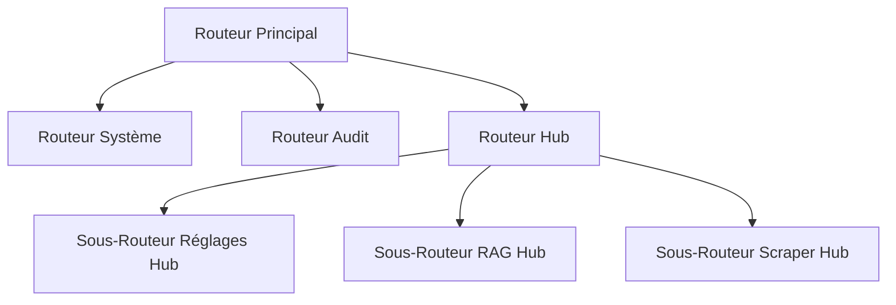

# Fiche Technique 01 — Infrastructure Core & Hub tRPC

## Objectif
Établir une fondation robuste, typée et modulaire pour le Knowledge Hub, lui permettant de coexister avec l'application existante sans régression tout en offrant une API unifiée.

---

## 🏗️ Architecture : Routeurs Modulaires

Le projet est passé d'un routeur unique à une architecture distribuée utilisant des sous-routeurs tRPC. Cette approche permet d'isoler la logique du Hub du reste de l'application.



### Fichiers Clés
- `server/routers/index.ts` : Le routeur racine qui fusionne tous les modules.
- `server/routers/hub/` : Répertoire dédié à la logique du Hub.
- `server/_core/context.ts` : Contexte TRPC enrichi pour la gestion des sessions et des utilisateurs.

---

## 🔐 Sécurité du Typage (tRPC + Zod)
Chaque appel au Hub est strictement typé. Cela empêche les erreurs d'exécution entre le frontend React et le backend Node.js en validant les données à l'entrée et à la sortie.

```ts
// Exemple : Schéma d'un réglage du Hub
export const HubSettingSchema = z.object({
  key: z.string(),
  value: z.string(),
  type: z.enum(["string", "number", "boolean", "password", "select"]),
  category: z.string(),
  description: z.string().nullable(),
});

// Implémentation du routeur
export const hubSettingsRouter = router({
  getSettings: protectedProcedure
    .query(async () => settingsService.getAllSettings()),
  updateSetting: protectedProcedure
    .input(z.object({ key: z.string(), value: z.string() }))
    .mutation(async ({ input }) => settingsService.set(input.key, input.value)),
});
```

---

## 🛠️ Performance : Tâches en Arrière-plan
L'infrastructure de base inclut un modèle d'exécution non bloquant pour les tâches lourdes (comme le scraping). Cela garantit que le serveur reste réactif pendant l'ingestion de données.

**Pattern : Fire-and-Forget avec Logging**
```ts
// server/_core/index.ts
if (await shouldReindex("all")) {
  console.log("[Hub] Indexation initiale requise...");
  scrapeAndIndex("all").catch(err => {
    console.error("[Hub] Échec de l'auto-indexation :", err);
  });
}
```
*Le serveur continue de démarrer et de répondre aux requêtes pendant que la tâche en arrière-plan gère l'ingestion des données.*

---

## ✅ Vérification & Résilience
- **Sécurité des Middlewares** : Toutes les routes du Hub utilisent `protectedProcedure`, ce qui nécessite une authentification valide.
- **Isolation de l'Environnement** : Utilisation de `dotenv` pour les configurations spécifiques au Hub (URL ChromaDB, clés LLM).
- **Gestion des Erreurs** : Formateur d'erreurs tRPC global pour masquer les traces de pile sensibles au client tout en les consignant sur le serveur pour le débogage.
