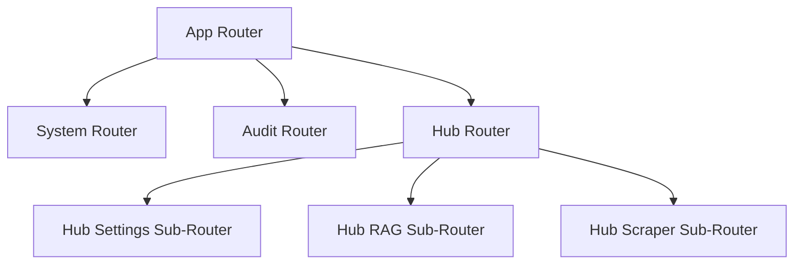

# Tech Sheet 01 — Core Infrastructure & tRPC Hub

## Objective
Establish a robust, type-safe, and modular foundation for the Knowledge Hub, allowing it to coexist with the existing application without regressions while providing a unified API.

---

## 🏗️ Architecture : Modular Routers

The project transition from a single router to a distributed architecture using tRPC sub-routers.



### Key Files
- `server/routers/index.ts` : The root router merging all modules.
- `server/routers/hub/` : Dedicated directory for Hub logic.
- `server/_core/context.ts` : Enhanced TRPC context for session and user handling.

---

## 🔐 Type Safety (tRPC + Zod)
Every Hub call is strictly typed. This prevents runtime errors between the React frontend and the Node.js backend.

```ts
// Example: Hub Settings Schema
export const HubSettingSchema = z.object({
  key: z.string(),
  value: z.string(),
  type: z.enum(["string", "number", "boolean", "password", "select"]),
  category: z.string(),
  description: z.string().nullable(),
});

// Router Implementation
export const hubSettingsRouter = router({
  getSettings: protectedProcedure
    .query(async () => settingsService.getAllSettings()),
  updateSetting: protectedProcedure
    .input(z.object({ key: z.string(), value: z.string() }))
    .mutation(async ({ input }) => settingsService.set(input.key, input.value)),
});
```

---

## 🛠️ Performance : Background Tasks
The Core Infrastructure includes a non-blocking execution model for heavy tasks (like scraping).

**Pattern : Fire-and-Forget with Logging**
```ts
// server/_core/index.ts
if (await shouldReindex("all")) {
  console.log("[Hub] Initial indexing needed...");
  scrapeAndIndex("all").catch(err => {
    console.error("[Hub] Auto-index failure:", err);
  });
}
```
*The server continues to start and serve requests while the background task handles the data ingestion.*

---

## ✅ Verification & Resilience
- **Middleware Security** : All Hub routes use `protectedProcedure` (requires authentication).
- **Environment Isolation** : Use of `dotenv` for specific Hub configurations (Chroma URL, LLM Keys).
- **Error Handling** : Global tRPC error formatter to hide sensitive stack traces from the client while logging them on the server.
