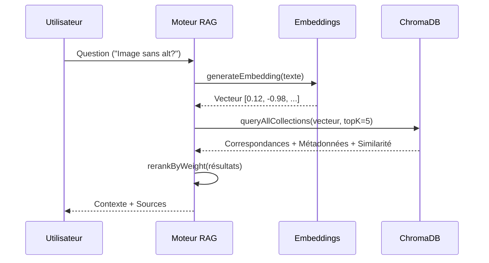

# Fiche Technique 02 — Moteur RAG & Base Vectorielle

## Objectif
Permettre une recherche sémantique à travers les directives d'accessibilité. Passer d'une recherche par mots-clés à une **recherche par concepts** en utilisant les embeddings vectoriels et ChromaDB.

---

## 🧠 Logique : Recherche Vectorielle Hybride

Le moteur RAG ne se contente pas de "chercher" ; il classe les connaissances en utilisant un partage de poids sur quatre collections spécialisées.

### Structure des Collections
| Collection | Contenu | Poids (Priorité) |
|---|---|---|
| `rgaa_referential` | Critères RGAA & Techniques WCAG | **1.0** (Base) |
| `rgaa_expertise` | Guides AcceDe Web & MDN | **1.3** (Élevé) |
| `rgaa_findings` | Historique des constats d'audit | **1.5** (Maximum) |
| `rgaa_code` | Snippets WAI-ARIA | **0.8** (Spécifique) |

---

## 🔄 Le Flux RAG



### Logique Clé : `ragEngine.ts`
```ts
// Recherche hybride sur plusieurs collections
async function queryHub(vector: number[], topK: number = 5) {
  const collections = ["rgaa_referential", "rgaa_expertise", "rgaa_findings", "rgaa_code"];
  const allHits = await Promise.all(
    collections.map(async col => {
      const results = await db.query(col, vector, topK);
      return applyWeight(results, getWeightFor(col));
    })
  );
  return flattenAndSort(allHits);
}
```

---

## 🛠️ Performance & Évolutivité
- **Idempotence** : Chaque document possède un identifiant unique : `sha256(contenu + métadonnées)`. Cela empêche les doublons de vecteurs si un scraper est exécuté plusieurs fois.
- **Indexation par Lots** : Les scrapers génèrent des résultats en masse, ce qui réduit le nombre d'allers-retours vers ChromaDB.
- **Persistance Locale** : ChromaDB fonctionne comme un service séparé (Docker ou Python), garantissant que le stockage vectoriel est indépendant de la mémoire de l'application principale.

---

## 🛡️ Résilience
- **Seuil de Similarité** : Tout résultat ayant un score de similarité < `0.65` (configurable) est ignoré pour éviter les hallucinations avec des données non pertinentes.
- **Gestion de l'État Vide** : Si les collections sont vides, le moteur déclenche un drapeau "Cold Start", informant le système qu'un scraping initial est requis pour fonctionner.
