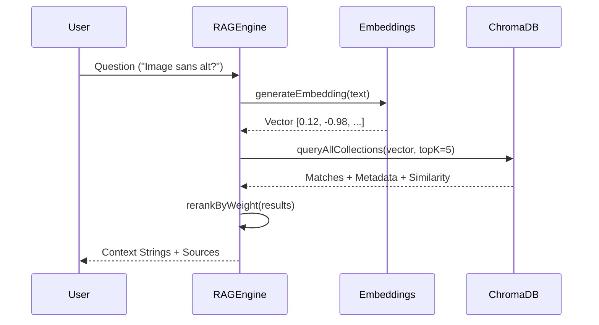

# Tech Sheet 02 — RAG Engine & Vector Store

## Objective
Enable semantic search across accessibility guidelines. Move from keyword-based search to **concept-based search** using vector embeddings and ChromaDB.

---

## 🧠 Logic : Hybrid Vector Search

The RAG engine doesn't just "search"; it ranks knowledge using weight-sharing across four specialized collections.

### Collections Structure
| Collection | Content | Weight (Priority) |
|---|---|---|
| `rgaa_referential` | RGAA Criteria & WCAG Techniques | **1.0** (Base) |
| `rgaa_expertise` | AcceDe Web & MDN Guides | **1.3** (High) |
| `rgaa_findings` | Past Audit Findings (History) | **1.5** (Highest) |
| `rgaa_code` | WAI-ARIA Snippets | **0.8** (Specific) |

---

## 🔄 The RAG Flow



### Key Logic : `ragEngine.ts`
```ts
// Hybrid search with multiple collections
async function queryHub(vector: number[], topK: number = 5) {
  const collections = ["rgaa_referential", "rgaa_expertise", "rgaa_findings", "rgaa_code"];
  const allHits = await Promise.all(
    collections.map(async col => {
      const results = await db.query(col, vector, topK);
      return applyWeight(results, getWeightFor(col));
    })
  );
  return flattenAndSort(allHits);
}
```

---

## 🛠️ Performance & Scalability
- **Idempotency** : Every document has a unique ID : `sha256(content + metadata)`. This prevents duplicate vectors if a scraper is run multiple times.
- **Batched Indexing** : Scrapers generate results in bulk, reducing the number of round-trips to ChromaDB.
- **Local Persistence** : ChromaDB runs as a separate service (Docker or Python), ensuring that vector storage is independent of the main app's memory.

---

## 🛡️ Resilience
- **Similarity Threshold** : Any result with a similarity score < `0.65` (configurable) is ignored to avoid hallucinations with irrelevant data.
- **Empty State Handing** : If collections are empty, the engine triggers a "Cold Start" flag, notifying the system that an initial scrape is required.
