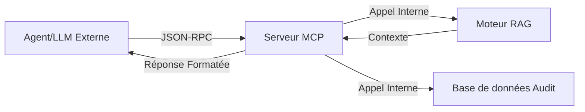

# Fiche Technique 03 — Intégration MCP (Model Context Protocol)

## Objectif
Exposer l'expertise spécialisée du Knowledge Hub à des agents IA externes (comme Claude ou ChatGPT) via un protocole standard, transformant l'application en un **Fournisseur d'Outils** (Tool Provider).

---

## 🛠️ Passerelle MCP : Le Pont

Le serveur MCP agit comme un traducteur entre la logique interne RAG/DB de l'application et le schéma universel d'appel d'outils requis par les grands modèles de langage (LLM).



---

## 🧰 Outils Exposés

Les outils suivants sont implémentés dans `server/mcp.ts` :

| Nom de l'outil | Paramètres | Logique Interne |
|---|---|---|
| `ask_accessibility` | `question` | Exécute `ragEngine.queryHub` + `invokeHubLLM`. |
| `analyze_code` | `htmlSnippet` | Extrait le contexte pour le snippet et demande les défauts d'accessibilité. |
| `suggest_fix` | `findingId`, `code` | Croise un constat avec les patterns WAI-ARIA pour suggérer un patch. |
| `validate_finding` | `draftText` | Valide si un projet de constat respecte la terminologie RGAA 4.1. |

---

## 🧪 Détail de l'Implémentation (`mcp.ts`)

L'implémentation utilise le **SDK MCP** pour définir les ressources et les outils de manière standardisée.

```ts
const server = new Server({
  name: "rgaa-knowledge-hub",
  version: "1.0.0",
}, {
  capabilities: { tools: {} }
});

// Exemple d'enregistrement d'outil
server.tool(
  "ask_accessibility",
  { question: z.string() },
  async ({ question }) => {
    const context = await ragEngine.search(question);
    const answer = await invokeHubLLM({ 
      systemPrompt: buildHubSystemPrompt(),
      messages: [{ role: "user", content: `Context: ${context}\n\nQuestion: ${question}` }]
    });
    return { content: [{ type: "text", text: answer }] };
  }
);
```

---

## 🔐 Sécurité & Contraintes
- **Isolation** : Le serveur MCP fonctionne comme un point d'entrée séparé (`pnpm mcp`), ce qui signifie qu'il peut être déployé indépendamment de l'interface web principale.
- **Lecture Seule (Majorité)** : Les outils sont principalement conçus pour des opérations de "Lecture" ou d'"Analyse". Les actions sensibles comme `trigger_reindex` nécessitent un jeton administratif spécifique.
- **Limitation de Débit** : Limitation intégrée pour empêcher un agent externe de saturer les fournisseurs de LLM (particulièrement avec les modèles de "Reasoning" coûteux).
