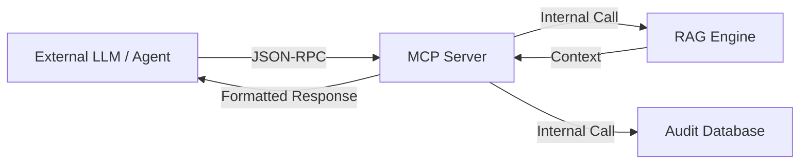

# Tech Sheet 03 — MCP (Model Context Protocol) Integration

## Objective
Expose the Knowledge Hub specialized expertise to external AI agents (like Claude or ChatGPT) through a standard protocol, turning the application into a **Tool Provider**.

---

## 🛠️ MCP Gateway : The Bridge

The MCP server acts as a translator between the application's internal RAG/DB logic and the universal tool-calling schema required by large language models.



---

## 🧰 Exposed Tools

The following tools are implemented in `server/mcp.ts` :

| Tool Name | Parameters | Internal Logic |
|---|---|---|
| `ask_accessibility` | `question` | Runs `ragEngine.queryHub` + `invokeHubLLM`. |
| `analyze_code` | `htmlSnippet` | Extracts context for the snippet and asks for accessibility defects. |
| `suggest_fix` | `findingId`, `code` | Cross-references a finding with WAI-ARIA patterns to suggest a patch. |
| `validate_finding` | `draftText` | Validates if a drafted audit finding respects RGAA 4.1 terminology. |

---

## 🧪 Implementation Detail (`mcp.ts`)

The implementation uses the **MCP SDK** to define resources and tools.

```ts
const server = new Server({
  name: "rgaa-knowledge-hub",
  version: "1.0.0",
}, {
  capabilities: { tools: {} }
});

// Tool registration example
server.tool(
  "ask_accessibility",
  { question: z.string() },
  async ({ question }) => {
    const context = await ragEngine.search(question);
    const answer = await invokeHubLLM({ 
      systemPrompt: buildHubSystemPrompt(),
      messages: [{ role: "user", content: `Context: ${context}\n\nQuestion: ${question}` }]
    });
    return { content: [{ type: "text", text: answer }] };
  }
);
```

---

## 🔐 Security & Constraints
- **Isolation** : The MCP server runs as a separate entry point (`pnpm mcp`), meaning it can be deployed independently of the main web UI.
- **Read-Only (Mostly)** : Tools are primarily designed for "Read" or "Analyze" operations. Sensitive actions like `trigger_reindex` require a specific flag or administrative token.
- **Rate Limiting** : Built-in throttling to prevent an external agent from saturating the LLM providers (especially with expensive "Reasoning" models).
