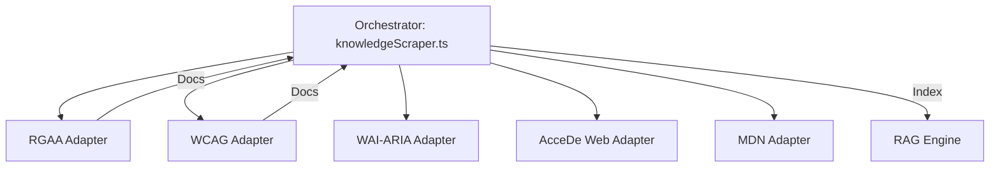

# Tech Sheet 04 — Scraper Framework & Adapters

## Objective
Maintain a relevant and up-to-date knowledge base by periodically ingesting official accessibility sources.

---

## 🏗️ Design : Module-per-Source

The framework is built to be modular and resilient. Each source has its own isolated "Adapter" that handles its specific complexities (HTML parsing, JS rendering, rate limiting).



---

## 🛠️ Data Handling Strategies

| Source | Tech Stack | Strategy |
|---|---|---|
| **RGAA** | `fetch` + Regex | Parses the official Markdown and HTML. Uses a **local JSON fallback** if the site is offline. |
| **WCAG** | `fetch` + `marked` | Deep crawls techniques from W3C. |
| **WAI-ARIA**| `playwright` | Special handling for React-based patterns that require JS rendering. |
| **AcceDe Web**| `fetch` + `marked` | Extracts structured notices for dev/design. |
| **MDN** | `fetch` + API | Targets high-authority articles on ARIA roles and semantic HTML. |

---

## 🔄 Idempotency & Hashing

To avoid duplicate entries in the vector store, every scraped document is hashed using SHA-256 before indexing.

```ts
// server/hub/scrapers/utils.ts
export function generateDocId(source: string, content: string): string {
  return crypto.createHash('sha256')
    .update(`${source}:${content}`)
    .digest('hex');
}
```
*If the content hasn't changed since the last scrape, ChromaDB simply updates the existing record instead of creating a new one.*

---

## 🛡️ Resilience & Fallbacks
- **Offline Reliability** : The RGAA referential (base of everything) is stored at `server/hub/data/rgaa-4.1.2.json` to ensure the app works even without an internet connection.
- **Retry Logic** : Each adapter has a 3-attempt retry policy with exponential backoff.
- **Resource Protection** : Concurrency is limited to 5 simultaneous requests to avoid being blocked by source servers or overloading the LLM embedding API.
