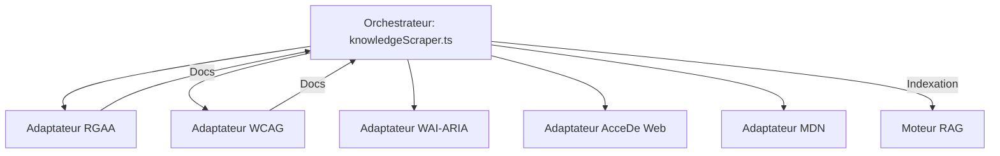

# Fiche Technique 04 — Framework de Scraping & Adaptateurs

## Objectif
Maintenir une base de connaissances pertinente et à jour en ingérant périodiquement les sources officielles d'accessibilité.

---

## 🏗️ Conception : Un Module par Source

Le framework est conçu pour être modulaire et résilient. Chaque source possède son propre "Adaptateur"對 (Adapter) isolé qui gère ses complexités spécifiques (parsing HTML, rendu JS, limitation de débit).



---

## 🛠️ Stratégies de Manipulation des Données

| Source | Stack Technologique | Stratégie de Collecte |
|---|---|---|
| **RGAA** | `fetch` + Regex | Analyse le Markdown et le HTML officiels. Utilise un **fallback JSON local** si le site est hors ligne. |
| **WCAG** | `fetch` + `marked` | Analyse en profondeur les techniques du W3C. |
| **WAI-ARIA**| `playwright` | Gestion spéciale pour les patterns basés sur React qui nécessitent un rendu JavaScript. |
| **AcceDe Web**| `fetch` + `marked` | Extrait des notices structurées pour le développement et le design. |
| **MDN** | `fetch` + API | Cible les articles à haute autorité sur les rôles ARIA et le HTML sémantique. |

---

## 🔄 Idempotence & Hachage

Pour éviter les entrées en double dans la base vectorielle, chaque document scrappé est haché à l'aide de SHA-256 avant l'indexation.

```ts
// server/hub/scrapers/utils.ts
export function generateDocId(source: string, content: string): string {
  return crypto.createHash('sha256')
    .update(`${source}:${content}`)
    .digest('hex');
}
```
*Si le contenu n'a pas changé depuis le dernier scraping, ChromaDB met simplement à jour l'enregistrement existant au lieu d'en créer un nouveau.*

---

## 🛡️ Résilience & Replis (Fallbacks)
- **Fiabilité Hors-Ligne** : Le référentiel RGAA (base de tout le système) est stocké dans `server/hub/data/rgaa-4.1.2.json` pour garantir que l'application fonctionne même sans connexion Internet.
- **Logique de Réessai** : Chaque adaptateur dispose d'une politique de 3 tentatives de réessai avec un délai d'attente exponentiel.
- **Protection des Ressources** : La concurrence est limitée à 5 requêtes simultanées pour éviter d'être bloqué par les serveurs sources ou de surcharger l'API d'embedding LLM.
