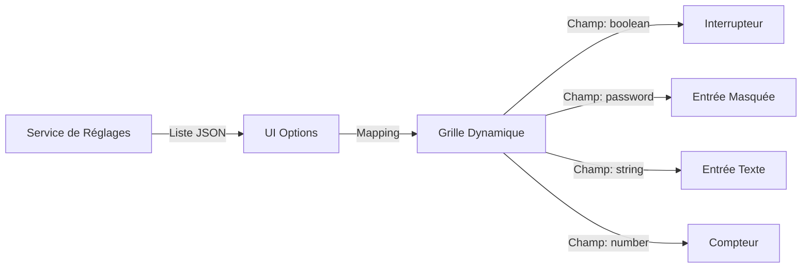

# Fiche Technique 05 — Hub Admin & Réglages Dynamiques

## Objectif
Fournir une interface centralisée pour configurer, surveiller et contrôler le Knowledge Hub sans avoir besoin de modifier les variables d'environnement ou de redémarrer le serveur.

---

## 🎨 Pattern UI : Formulaires Dynamiques par Catégorie

La page `Options.tsx` ne code pas en dur les réglages individuels. Au lieu de cela, elle interroge le backend pour obtenir tous les réglages groupés par catégorie et génère dynamiquement le type d'entrée approprié.



---

## 💾 Stockage & Mise en Cache : `settingsService.ts`

Pour éviter de solliciter la base de données MySQL à chaque appel LLM ou RAG, le service de réglages implémente un **cache en mémoire**.

### Flux Logique
1. **Requête** : `settingsService.get("llm.model")`
2. **Vérification du Cache** : S'il est présent et non expiré, retour immédiat.
3. **Récupération DB** : S'il est manquant, requête à la table `hub_settings`.
4. **Mise à jour du Cache** : Stocke le résultat pour les futurs appels.
5. **Invalidation** : Lorsqu'un utilisateur met à jour un réglage via l'UI, le cache est vidé pour cette clé spécifique.

---

## 🚀 Surveillance : Le Tableau de Bord du Scraper

L'Admin Hub inclut une interface de surveillance en temps réel pour les opérations de scraping :
- **Barre de Progression** : Calculée en fonction du nombre de sources terminées par rapport au nombre total de sources.
- **Boucle de Polling** : L'interface appelle `getScraperStatus` toutes les 3 secondes lorsqu'une opération est en cours.
- **Flux de Logs** : Affiche les 10 dernières activités (ex: "Techniques WCAG indexées : +120").

---

## ⚙️ Réglages Avancés (Mise à jour Phase 12)
Le Hub prend en charge des comportements IA avancés comme le **Reasoning d'OpenRouter**. Ceci est géré par un drapeau dédié dans le référentiel de réglages, que l'adaptateur LLM lit pour injecter des paramètres JSON spécifiques dans la requête.

```ts
// Exemple de logique d'injection dynamique de paramètres
if (setting("llm.reasoning") === "true" && provider === "openrouter") {
  payload.reasoning = { enabled: true };
}
```

---

## ✅ Résilience
- **Repli sur Connexion DB** : Si la base de données est injoignable, le système se replie automatiquement sur les `DEFAULT_SETTINGS` définis dans le code.
- **Validation** : Les types sont strictement validés via Zod du côté client et du côté serveur pour empêcher des configurations corrompues.
