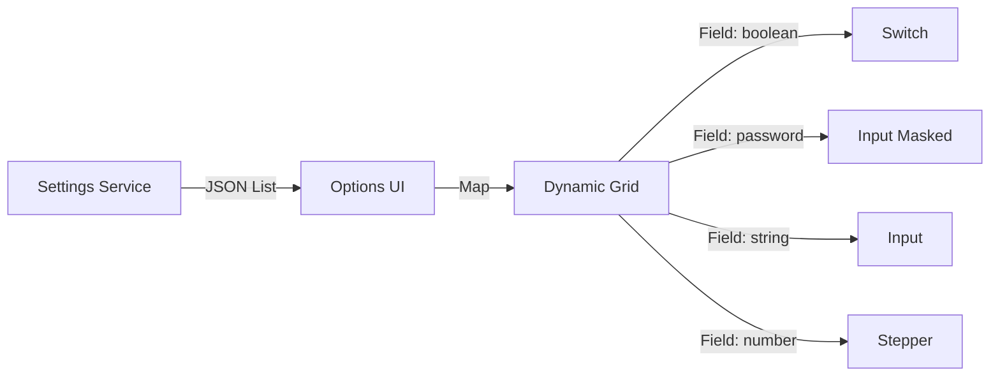

# Tech Sheet 05 — Admin Hub & Dynamic Settings

## Objective
Provide a centralized interface to configure, monitor, and control the Knowledge Hub without needing to modify environment variables or restart the server.

---

## 🎨 UI Pattern : Category-based Dynamic Forms

The `Options.tsx` page doesn't hardcode individual settings. Instead, it queries the backend for all settings grouped by category and generates the appropriate input type dynamically.



---

## 💾 Storage & Caching : `settingsService.ts`

To avoid hitting the MySQL database for every LLM or RAG call, the settings service implements an **in-memory cache**.

### Logic Flow
1. **Request** : `settingsService.get("llm.model")`
2. **Check Cache** : If present and not expired, return immediately.
3. **Fetch Database** : If missing, query `hub_settings` table.
4. **Update Cache** : Store the result for future calls.
5. **Invalidate** : When a user updates a setting via the UI, the cache is cleared for that specific key.

---

## 🚀 Monitoring : The Scraper Dashboard

The Admin Hub includes a real-time monitoring interface for scraping operations :
- **Progress Bar** : Calculated based on the number of sources completed vs total sources.
- **Polling Loop** : The UI calls `getScraperStatus` every 3 seconds while an operation is in progress.
- **Log Stream** : Displays the last 10 activities (e.g., "WCAG techniques indexed: +120").

---

## ⚙️ Advanced Settings (Phase 12 Update)
The Hub supports advanced AI behaviors like **OpenRouter Reasoning**. This is handled by a dedicated flag in the settings repository, which the LLM adapter reads to inject specific JSON parameters into the payload.

```ts
// Example of dynamic parameter injection logic
if (setting("llm.reasoning") === "true" && provider === "openrouter") {
  payload.reasoning = { enabled: true };
}
```

---

## ✅ Resilience
- **DB Connection Fallback** : If the database is unreachable, the system automatically falls back to the `DEFAULT_SETTINGS` defined in the code.
- **Validation** : Types are strictly validated via Zod on both client and server sides to prevent corrupted configurations.
