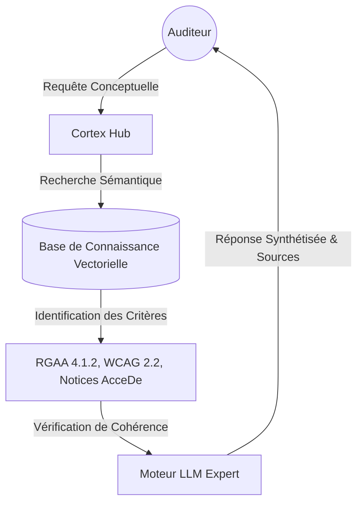

# RGAA Knowledge Hub — Guide de Référence Conceptuel

> [!NOTE]
> Ce document est conçu pour présenter la vision, la logique et les capacités du "cerveau" de l'application. Il explique comment le Hub assiste l'auditeur dans sa mission quotidienne.

---

## 🏗️ 1. Vision Stratégique

### 🌟 La Mission : "L'Auditeur Augmenté"
Le **RGAA Knowledge Hub** transforme l'application d'un simple extracteur de données en un **partenaire d'expertise intelligent**. Il centralise l'écosystème de l'accessibilité numérique (RGAA, WCAG, ARIA) pour éliminer les recherches manuelles fastidieuses.

- **Le Problème** : La dispersion des règles sur des dizaines de sites complexes.
- **La Solution** : Un cortex centralisé capable de comprendre l'intention de l'auditeur et de puiser dans les sources officielles pour répondre.
- **Le Bénéfice** : Zéro oubli, une précision absolue et une productivité multipliée.

### ⚙️ Les Piliers du Succès

| Pilier | Définition |
|:--- |:--- |
| **Fiabilité (RAG)** | L'IA ne "raconte" rien qu'elle n'ait lu au préalable dans les référentiels officiels. |
| **Intelligence (Semantic)** | Compréhension des concepts : chercher "problème de lien" trouve aussi les erreurs sur les "attributs de navigation". |
| **Performance (Ultra-Speed)** | Les résultats s'affichent instantanément (< 300ms) même avec des milliers de données en mémoire. |
| **Confidentialité (Isolation)** | Vos données et vos rapports restent dans votre sphère privée, totalement isolés des autres utilisateurs. |

---

## 🧠 2. Logique de l'IA (Cortex)

Le Hub ne se contente pas de stocker des textes ; il les structure pour que l'IA puisse "raisonner" comme un expert.



---

## 🛠️ 3. L'Évolution du Projet

Le système a grandi par vagues successives pour atteindre sa maturité actuelle.

````carousel
### Vague 1 : Les Fondations
**Missions accomplies :**
- Création du "Cortex" (Moteur de recherche intelligent).
- Ingestion des 5 grands référentiels d'État (RGAA, WCAG, WAI-ARIA, AcceDe, MDN).
- Mise en place du protocole de communication universel.
<!-- slide -->
### Vague 2 : L'Expertise Profonde
**Missions accomplies :**
- Intégration du mode "Reasoning" (Pensée Logique) pour les cas d'accessibilité complexes.
- Ajout de la Recherche Smart dans la bibliothèque de constats historiques.
- Auto-alimentation du cerveau à chaque nouvel import de rapport.
<!-- slide -->
### Vague 3 : La Maîtrise (Aujourd'hui)
**Missions accomplies :**
- **Vitesse de Révolution** : Optimisation des flux pour un affichage instantané.
- **Protection Totale** : Mise en place de l'isolation utilisateur hermétique.
- **Précision Chirurgicale** : Filtres intelligents par page, thématique et impact.
````

---

## 🛡️ 4. Robustesse & Sécurité

La fiabilité est notre boussole. Chaque réponse du Hub repose sur deux sécurités :

1.  **Sécurité Sémantique** : L'IA valide ses sources à chaque mot. Si un critère (ex: 7.1) est mentionné, elle verrouille son attention sur ce critère précis.
2.  **Sécurité des Flux** : Une logique de dégraissage intelligent élimine le "bruit" numérique pour ne garder que la "substance" utile, garantissant que le système reste fluide même sous forte charge.

---

## 🔮 5. Évolutions Futures

Le Hub prépare déjà sa prochaine mutation :
- **Auto-Correction** : Suggestions de patchs de code applicables en un clic.
- **Vision Expert** : Analyse des maquettes graphiques avant même la phase de code.
- **Spécialisation Fine** : Entraînement sur des cas d'audit réels pour une finesse d'analyse inégalée.
