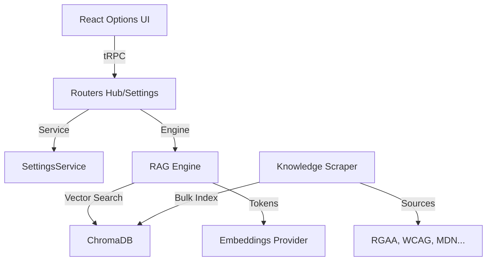

# RGAA Knowledge Hub — Référence de Développement

> [!NOTE]
> Ce document est le guide de référence pour comprendre, installer et faire évoluer le Knowledge Hub. Il synthétise la vision produit, les choix d'architecture et les étapes de réalisation.

---

## 🏗️ 1. Vision du Projet

### 🌟 Utilité Fonctionnelle
Le **RGAA Knowledge Hub** transforme l'application d'un simple extracteur de données statiques en un **système expert d'audit augmenté**.
- **Problème** : Les auditeurs doivent jongler entre 106 critères RGAA, des centaines de techniques WCAG et des guides de code ARIA dispersés.
- **Solution** : Un moteur RAG (Retrieval-Augmented Generation) qui centralise toutes ces connaissances.
- **Bénéfice** : L'IA peut désormais répondre à des questions complexes ("Comment rendre ce bouton accessible ?"), analyser du code HTML en temps réel et suggérer des corrections basées sur les référentiels officiels.

### ⚙️ Architecture & Choix Techniques

| Technologie | Pourquoi ce choix ? |
|:--- |:--- |
| **tRPC** | Garantie de types de bout en bout (zéro erreur de schéma entre client et serveur). Rapidité de développement sans écrire de boilerplate REST. |
| **ChromaDB** | Base vectorielle haute performance permettant la **recherche sémantique**. Contrairement au SQL, elle trouve des concepts proches même si les mots-clés diffèrent. |
| **MCP SDK** | Interopérabilité. Permet aux agents IA externes (Claude, ChatGPT via MCP) d'utiliser nos outils d'expertise accessibilité nativement. |
| **Drizzle ORM** | Typage TypeScript strict des schémas SQL. Très léger, il évite la surcharge d'un gros ORM tout en sécurisant les accès MySQL. |
| **Playwright** | Indispensable pour scraper les sources modernes (SPA React) comme le W3C APG, là où un simple fetch échouerait. |

---

## 📋 2. Sommaire

1. [🏗️ Vision du Projet](#️-1-vision-du-projet)
2. [🚀 Guide d'Installation Locale](#-3-guide-dinstallation-locale)
3. [🧩 Structure du Code](#-4-structure-du-code)
4. [🛠️ Développement par Blocs](#️-5-développement-par-blocs)
5. [🛡️ Qualité & Résilience](#️-6-qualité--résilience)

---

## 🚀 3. Guide d'Installation Locale

### Pré-requis
- **Node.js 20+** et **pnpm**
- **Docker** (recommandé pour ChromaDB)
- **MySQL** instance

### Étape 1 : Installation
```bash
pnpm install
pnpm exec playwright install chromium
```

### Étape 2 : Configuration
Copiez `.env.example` vers `.env` et renseignez les variables :
- `DATABASE_URL` : Connexion MySQL
- `CHROMA_HOST` : `http://localhost:8000`
- `OLLAMA_HOST` (ou OpenAI Key) : Pour les embeddings et le LLM.

### Étape 3 : Base de données
```bash
pnpm db:push
```

### Étape 4 : Lancement des dépendances (ChromaDB)
Si vous utilisez Docker :
```bash
docker run -d -p 8000:8000 chromadb/chroma
```

### Étape 5 : Démarrage
```bash
pnpm dev
```
*Le serveur détectera automatiquement si les collections sont vides et lancera l'indexation initiale en tâche de fond.*

---

## 🧩 4. Structure du Code



### Fichiers Clés
- `server/hub/ragEngine.ts` : Le cerveau effectuant les recherches vectorielles.
- `server/hub/settingsService.ts` : Gestionnaire de configuration avec cache mémoire.
- `server/hub/knowledgeScraper.ts` : Orchestrateur de collecte de données.
- `client/src/pages/Options.tsx` : Tableau de bord de pilotage du Hub.

---

## 🛠️ 5. Développement par Blocs

### Bloc A : Fondations & Ingestion (Phases 0-6)
- **Refactoring** : Modularisation des routers tRPC pour une meilleure scalabilité.
- **Scrapers** : Implémentation d'adaptateurs pour 5 sources majeures (RGAA, WCAG, WAI-ARIA, AcceDe, MDN).
- **Pipeline** : Mise en place d'un système d'upsert idempotent (SHA-256) évitant tout doublon dans la base vectorielle.

### Bloc B : Moteur RAG & MCP (Phases 3-5)
- **Engine** : Algorithme de recherche hybride avec pondération par collection.
- **MCP** : Exposition des outils (`ask_accessibility`, `analyze_code`, `suggest_fix`) via le protocole open-source de Google-Anthropic.

### Bloc C : Contrôle & UI (Phases 7-9)
- **Settins UI** : Interface riche sous Tailwind/Shadcn pour configurer les providers LLM sans redémarrage.
- **Automatisme** : Intégration du bootstrap intelligent (auto-scrape au boot si vide).

---

## 🛡️ 6. Qualité & Résilience

Le projet a subi une **Double Review** systématique :

1. **Qualité du Code** :
   - Migration totale vers ES Modules (`import`).
   - Typage strict des réponses tRPC avec Zod.
   - Robustesse des boucles asynchrones (concurrence limitée à 5 pour ne pas saturer le CPU/GPU).

2. **Résilience Fonctionnelle** :
   - **Mode Dégradé** : Si ChromaDB est offline, le système bascule automatiquement sur une recherche SQL simplifiée.
   - **Fallback Réseau** : Le référentiel RGAA possède une copie JSON locale en cas d'indisponibilité du site officiel.
   - **Mutex de Scrape** : Empêche deux indexations concurrentes de corrompre les données.

> [!TIP]
> Pour vérifier l'intégrité du code à tout moment, lancez : `pnpm check` (ou `tsc --noEmit`).

---

## 🔮 7. Évolutions Futures

Pour aller encore plus loin dans l'expertise accessibilité, les axes suivants sont envisagés :
1. **Multi-Langualité Étendue** : Support complet des référentiels anglais (WCAG pur) et espagnols (pour les projets internationaux).
2. **Auto-Correction** : Un outil MCP capable de modifier directement le fichier source HTML pour appliquer le patch suggéré par `suggest_fix`.
3. **Audit de Design (Figma)** : Intégration du Hub dans les outils de design pour valider les contrastes et les structures avant même le développement.
4. **Fine-Tuning** : Entraînement d'un modèle léger spécialisé RGAA sur les milliers de constats réels anonymisés pour une précision absolue.
